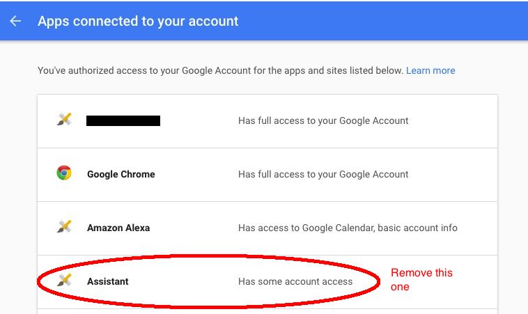
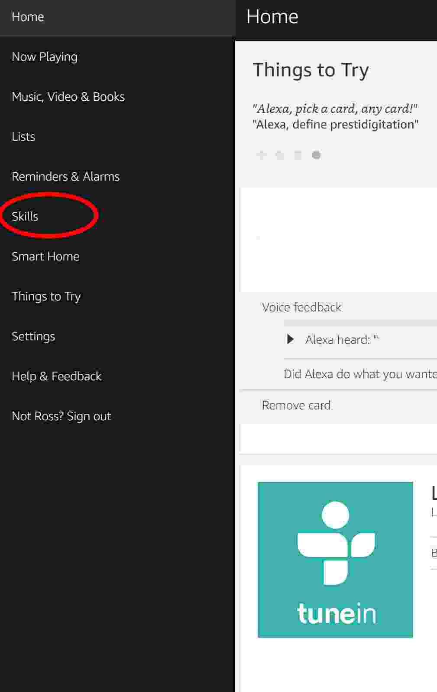
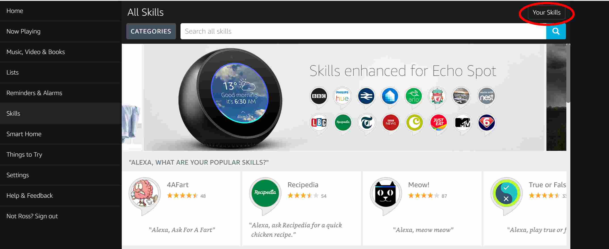
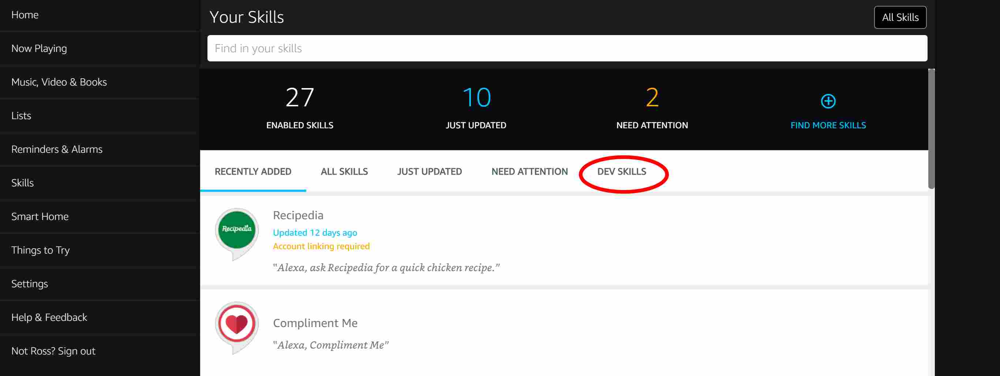
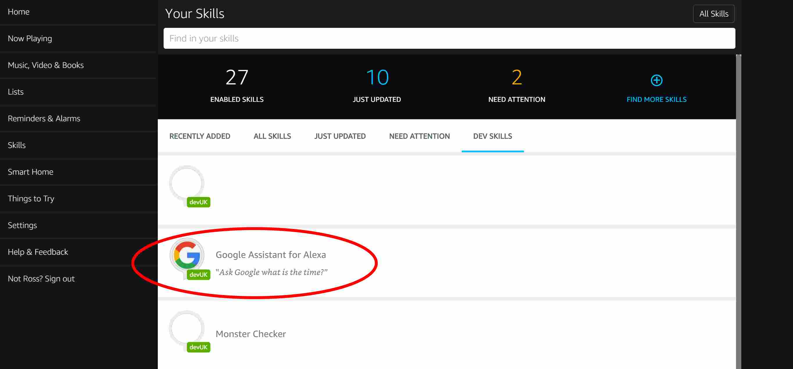
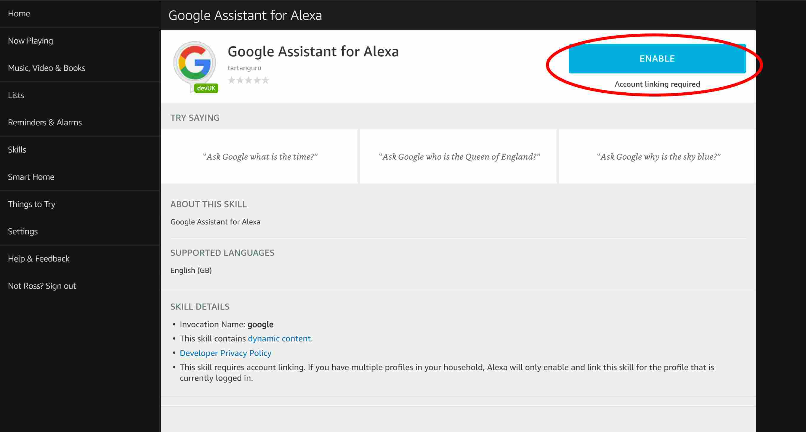
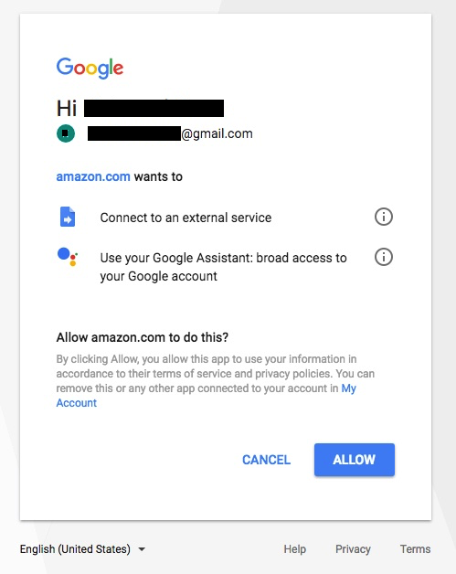
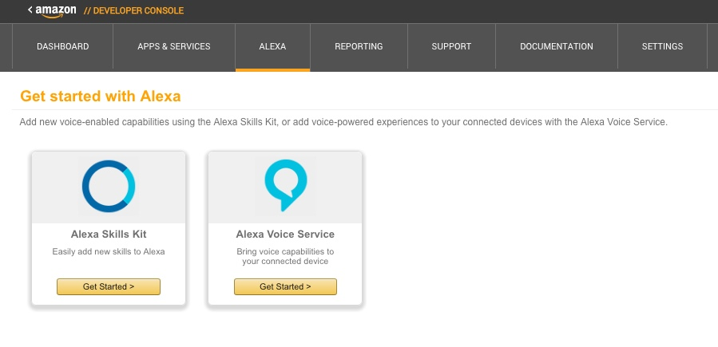
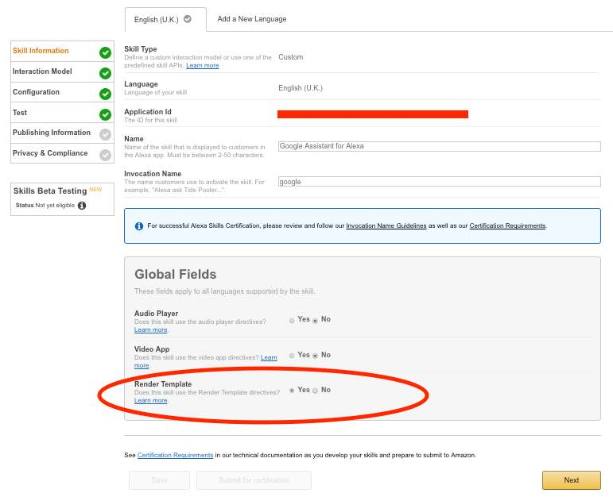

# Common issues

Please check these common problem solving steps before raising an issue:-

# Alexa says "Sorry, something went wrong" when I try and launch the skill

This is usually caused by your Skill being set-up in a different language to your Echo device. You need to have the skill in the SAME langauge as your device is set to.

The other cause of this issue is the Echo devcie being on a different user profile to the one used to set-up the skill

# Google Assistant says  "I need your permission to help you"

You’ve missed turning on a blue slider at the step where you have to give the google assistant access to you google activities history. 

Open the Activity Controls page https://myaccount.google.com/activitycontrols for the Google account that you want to use with the Assistant. Ensure the following toggle switches are enabled (blue):

    1. Web & App Activity - Make sure the box marked "Include Chrome browsing history and activity from websites and apps that use Google Services" is also checked 
    2. Location History
    3. Device Information
    4. Voice & Audio Activity

# The skill keeps asking me to link my Google Account

This seems to be an issue with the Google Amazon authentication. The fix for this is as follows:-

1. Unlink the deauthorise the app aby removing it from your google account by going here https://myaccount.google.com/permissions?pli=1 and select the app called "alexa-assistant".
2. Click on the button labelled "Remove Access"
3. Press "Yes" to confirm

4. Go to the Alexa web app and log in alexa.amazon.com
5. Select "Skills" from the Home menu on the right hand side of the screen

6. Click on "Your Skills" at the top right

7. Click on "Dev Skills"

8. Click on the skill called "Google Assistant for Alexa"

9. Click on "Disable Skill"

10.  Now click on "Enable Skill"

11. Select the Google account you want to use and then make sure you click "Allow" on the Google authorisation page. 

# When I run the skill on my Echo Show/Spot I get the error ""There was a Problem with Requested Skills Response"

You have missed a step in the setup process. To resolve this:-

1. Go to the Alexa developer console and login

https://developer.amazon.com/edw/home.html

2. Click on the yellow "Get Started" button under Alexa Skills Kit.

3. Select the Google Assistant Skill that your previously created
4. Go to the Skill Information tab and make sure "Render Template is set to Yes"

5. Click "Save" and then click "Next".

# When I run the skill I get the error "I could not load the client secret file from S3. Please make sure that you have uploaded it into the correct place on the S3 bucket"

There are 3 likely causes:-

1. You have not uploaded your client_secret.json to the S3 bucket. Doing so will fix this issue
2. You have incorrectly renamed the file. Rename it correctly and re-upload to the S3 bucket. This will fix the issue
3. You have renamed the file client_secret.json.json as file extensions are hidden on your system. Remove the extra .json and re-upload to the S3 bucket. This will fix the issue

