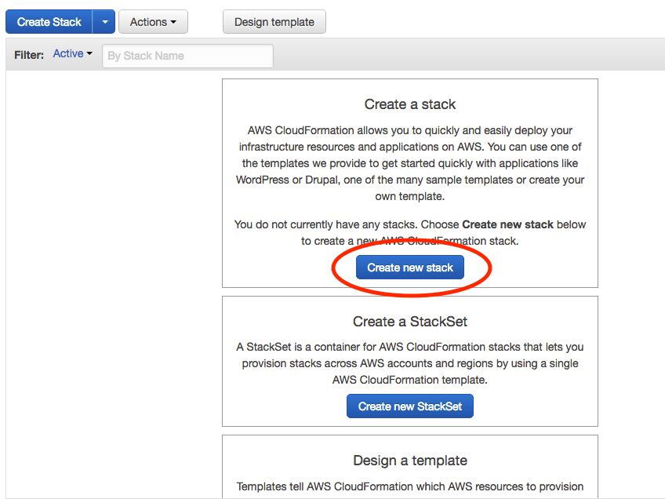

If you wish to delete the stack that was created for the skill then please follow the instructions below:

1. Goto https://console.aws.amazon.com/ and log into your account
2. Click the AWS Services menu at the top left and then select "CloudFormation" from the "Management Tools" section

3. Find the stack that we created (it will be called "AlexaAssistant")
4. Tick the box next to it's name

5. Press the "Action" button and select "Delete Stack" fromt he dropdown menu

6. A box will apear asking you to confirm - press "Yes - delete"

7. Cloudformation will then start to delete the stack. THIS WILL TAKE SOME TIME.

8. You can check progress by clicking on the refresh button towards the top right of the page

9. You may get an error under status that says "DELETE_FAILED". If this is the case then go through the delete steps again as per the above

10. This time you will get a more detailed confirmation asking whether you wish to delete an S3 bucket that has content in it. Tick the box next to the Logical Id called "S3 Bucket" and press "Yes - delete"

11. Cloudformation will then start to delete the stack again. THIS WILL TAKE SOME TIME.

12. If the delete is sucessful then you will be taken back to the screen below

