# New Installation Instructions

If you already have Version 1 of the skill installed then please use the instructions here:-
[Upgrade Instructions](upgrade.md)

## MAKE SURE YOU DO THIS INSTALLATION ON A PC/MAC/LINUX MACHINE - A PHONE OR TABLET RUNNING iOS OR ANDROID WILL CAUSE ISSUES

# Sites reproducing installation instructions

These installation instructions and the CloudFormation template linked to in these instructions (provided for users installing the lambda function) are licenced under a [Creative Commons Attribution-NonCommercial-NoDerivatives 4.0 International License](http://creativecommons.org/licenses/by-nc-nd/4.0/)

If you wish to reproduce the installation instructions hosted on your own website (**I really wish you wouldn't as it makes my life very difficult to support and update the skill**) then you may do so and link to my Cloudformation template (and consequently the zips on my S3 buckets)  provided that there is no monetisation on the page e.g. adverts. If you do wish to have monetisation then you will need to create your own instructions and host your own Cloudformation template and associated zip files. 

I AM VERY SERIOUS ABOUT THIS POINT - I WILL BE CHECKING FREQUENTLY AND WILL CHANGE OR REMOVE THE CLOUDFORMATION TEMPLATE URL IF PEOPLE ARE ABUSING IT

NOTE: I have granted Paul Hibbert the rights to link to the Cloudformation for the purposes of his installation videos

## Installation

1. In a new browser tab/window go to https://developer.amazon.com/alexa
2. Click on the "Your Alexa Dashboards" at the top right of the screen

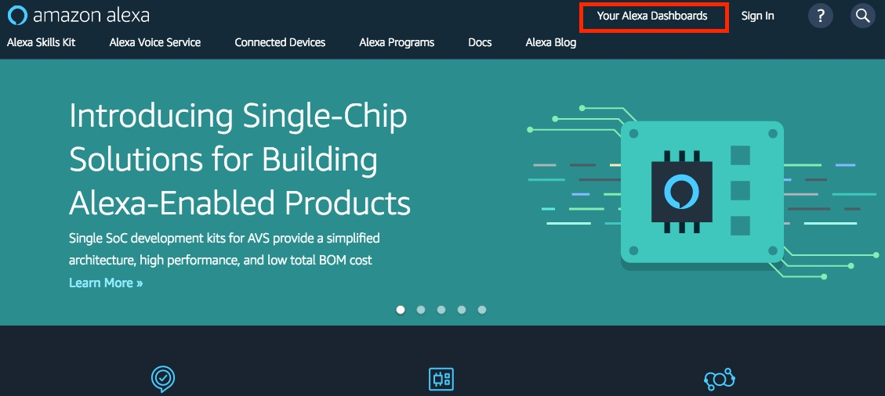

3. You will see an Amazon Login. If you already have an Amazon Developer account then login otherwise press the "Create your Amazon Developer account" button

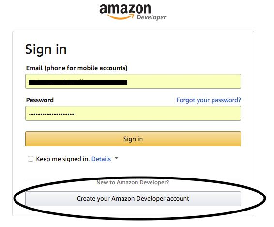

4. If you need to create a Developer account then fill in your details and ensure you answer "NO" for "Do you plan to monetize apps by charging for apps or selling in-app items" and "Do you plan to monetize apps by displaying ads from the Amazon Mobile Ad Network or Mobile Associates?"

## Skill Setup Part 1

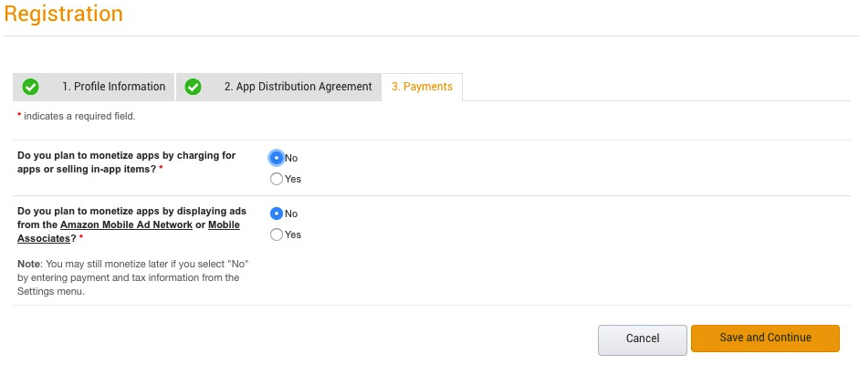

1. Once you are logged into your account click on the yellow "Get Started" button under Alexa Skills Kit.


3. Click the "Add a New Skill" yellow box towards the top right.

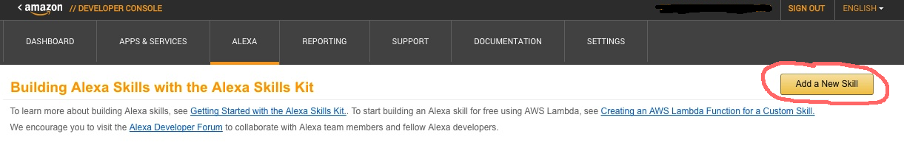

4. You will now be on the "Skill Information" page.
5. Set "Custom Interaction Model" as the Skill type
6. Select the correct langauge for your country (THIS IS IMPORTANT AS OTHERWISE THE SKILL WILL NOT LAUNCH)
7. Set the "Name" to 

    ```
    Google Assistant for Alexa
    ```
    
8. You can set the "Invocation Name" to whatever you want although some names work better than others. I have found that "google" or "my assistant" seem to work well. The name you choose will be the activation name e.g. "Alexa, ask my assistant how long will it take to drive to London?". For these instructions we will set "google" as the invocation name, so in this case you would say: "Alexa, Ask google who is the queen of england". For best results the invocation name should be lowercase **NOTE - if you have already installed my previous Google Skill and have used the "google" invocation name for this then you will either have to use a different invocation name for this skill or rename/delete the older Google skill.**

9. Under the Global Fields section, set the "Render Template" option to Yes. Leave all other settings to No
10. Click "Save" and then click "Next".

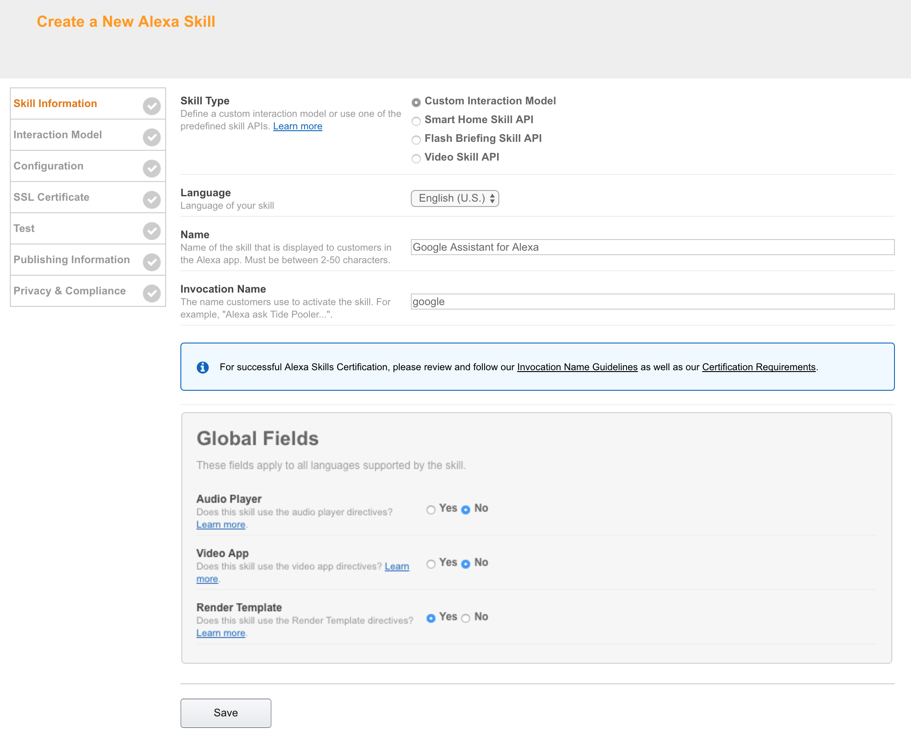

11. You will now be on the "Interaction Model" page.
12. Ignore the box lablled "Built-in intents for render template control"

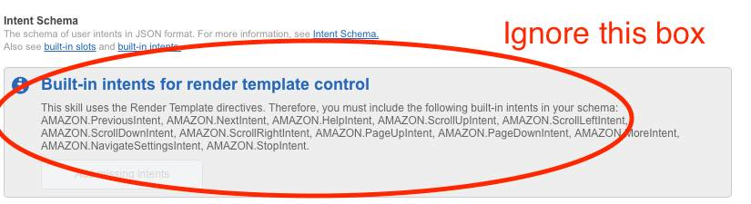

13. Copy the text below into the "Intent Schema" box.

    ```
    {
      "intents": [
        {
          "intent": "AMAZON.NavigateSettingsIntent"
        },
        {
          "intent": "AMAZON.MoreIntent"
        },
        {
          "intent": "AMAZON.PageDownIntent"
        },
        {
          "intent": "AMAZON.PageUpIntent"
        },
        {
          "intent": "AMAZON.ScrollRightIntent"
        },
        {
          "intent": "AMAZON.ScrollDownIntent"
        },
        {
          "intent": "AMAZON.ScrollLeftIntent"
        },
        {
          "intent": "AMAZON.ScrollUpIntent"
        },
        {
          "intent": "AMAZON.HelpIntent"
        },
        {
          "intent": "AMAZON.NextIntent"
        },
        {
          "intent": "AMAZON.PreviousIntent"
        },
        {
          "intent": "AMAZON.StopIntent"
        },
        {
          "intent": "AMAZON.CancelIntent"
        },
        {
          "intent": "AMAZON.NoIntent"
        },
        {
          "intent": "AMAZON.YesIntent"
        },
        {
          "slots": [
            {
              "name": "search",
              "type": "SEARCH"
            }
          ],
          "intent": "SearchIntent"
        }
      ]
    }
    ```
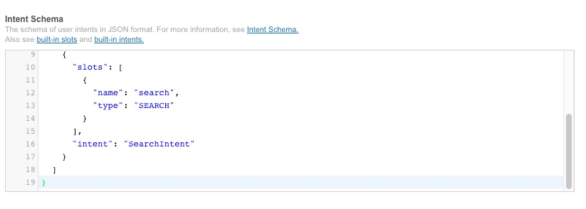

14. Under Custom Slot Types:-
15. Type into the "Enter Type" field (NOTE - this is capitalised) :-
    ```
    SEARCH
    ```
    
16. Copy the text below and paste into the "Enter Values" box. Once you've pasted them in press the return key to add one blank line at the end of the list

    ```
    who is the queen
    why is the sky blue
    ```
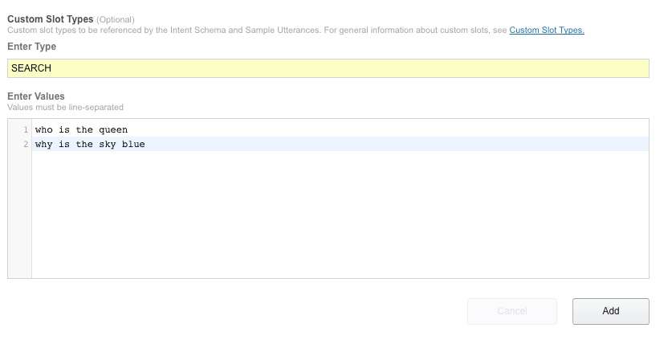

16. NOW MAKE SURE YOU PRESS THE "ADD" BUTTON UNDERNEATH THE BOX

17. Copy the text below and paste them into the Sample Utterances box. Again, once you've pasted them in press the return key to add one blank line at the end of the list

    ```
    SearchIntent {search}
    ```
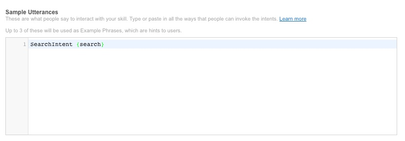 

18. Click "Save" and then "Next".
19. You will now be on the "Configuration" page.
20. Select "AWS Lambda ARN (Amazon Resource Name)" for the skill Endpoint Type.
21. Leave the "Default" box empty for the moment
22. Leave "Provide geographical region endpoints?" set to "No"

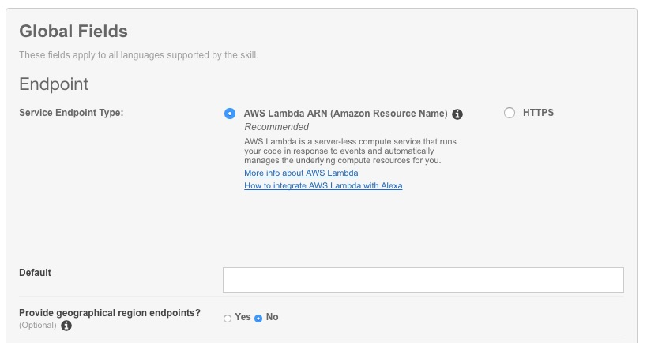 

23. Select "Yes" for Account Linking

24. Copy the  Redirect URLs lower down the page you are currently on (there will be a number of these the first should start https://layla.amazon.com/api/skill/link the secondhttps://pitangui.amazon.com/api/skill/link - see screenshot below) and paste them into a Notepad document on windows or TextEdit on mac. We will need these during the setup of the Google API and later on in the setup of the Lambda function

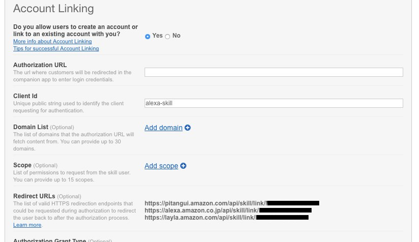

25. At this point we will pause the setup of the skill and setup the google API. 

**Leave this page open as we will come back to it after we have setup the Google Assistant API**

### Enable Google Assistant API:-
To enable access to the Google Assistant API, do the following:

1. In a **new** browser tab or window, go to the Cloud Platform Console here https://console.cloud.google.com/project (If this is the first time you have use the google developer console then you will need to agree to the Terms of service on the pop-up box.)
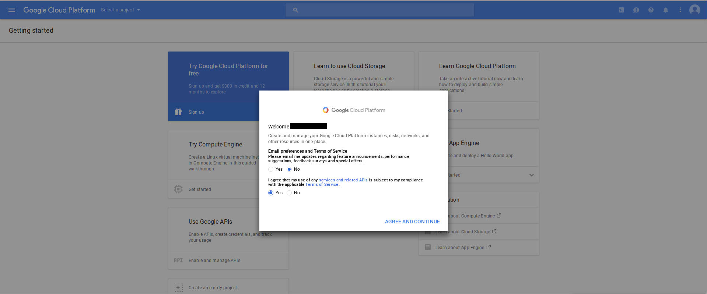

2. Click on "Select a project" and then the "+" button to create a new project
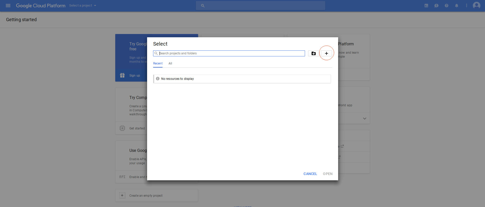

3. Give the project a name, it doesn't really matter what it is but it needs to be unique so Google will add a series of numbers to the end of the name if somebody has already used it. Press create.
4. You will be taken to a new page. It will take about 15 seconds for the project to be created. Look for a notification within the blue bar at the top of the page. Once the project is created click on the notification and then select the "Create Project: XXX" where XXX is the name that you gave the project.

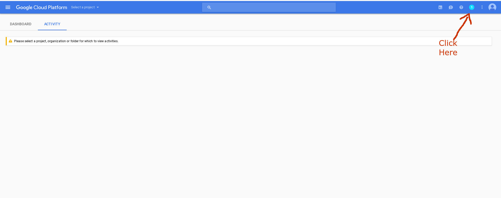

5. Click on this link: - https://console.developers.google.com/apis/api/embeddedassistant.googleapis.com/overview This will take you to a page entitled "API manager".
6. Click on the blue text near the top that says "ENABLE".

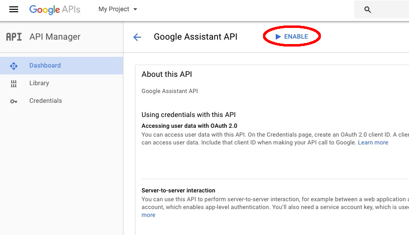

7. Once the next page had loaded - click on "Create Credentials"

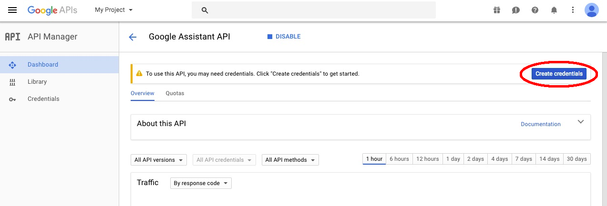

8. Make sure "Google Assistant API" is selected under "Which API are you using?"
9. Under "Where will you be calling the API from?" select "Web server (e.g. node.js, Tomcat)
10. Under "What data will you be accessing?" select "User data".
11. Click on the blue "What credentials do I need?" button.

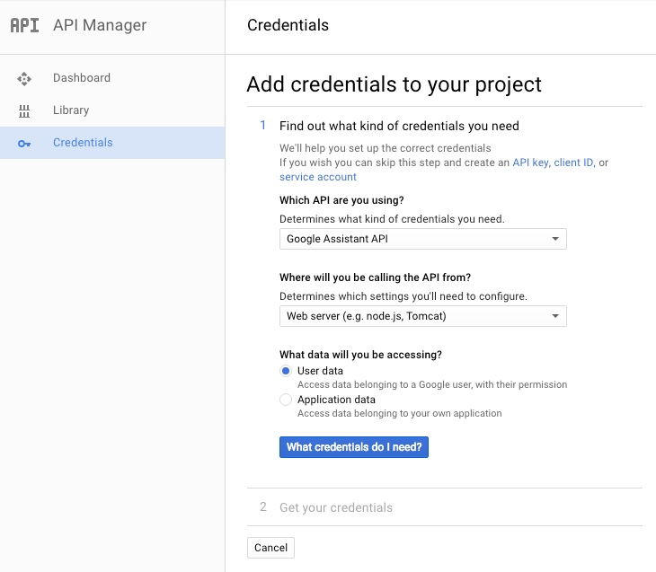

12. On the next page set the Name to :-

    ```
    google_assistant
    ```
    
13. Under Authorised redirect URIs, paste the first of the "Redirect URLS" from the skill setup page and hit "Enter"
(These are the one's you copied earlier from the Account Linking Section and put into your notepad file - it should start with https://pitangui.amazon.com)
14. A second box will appear - into this paste the second "Redirect URL" and then hit "Enter" again
15. Continue this process untill all redirect URLs than you copies from the skill setup have been entered
16. Click the blue "Create client ID" button.

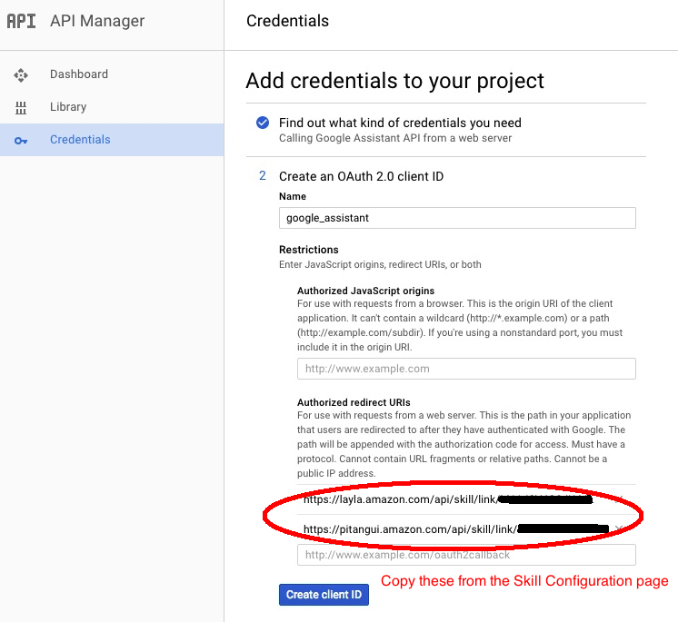

17. On the next page the Email address field should auto populate with your Google account email address
18. In the "Product name shown to users" enter:-

    ```
    Assistant
    ```

19. Click on the blue "Continue" button.

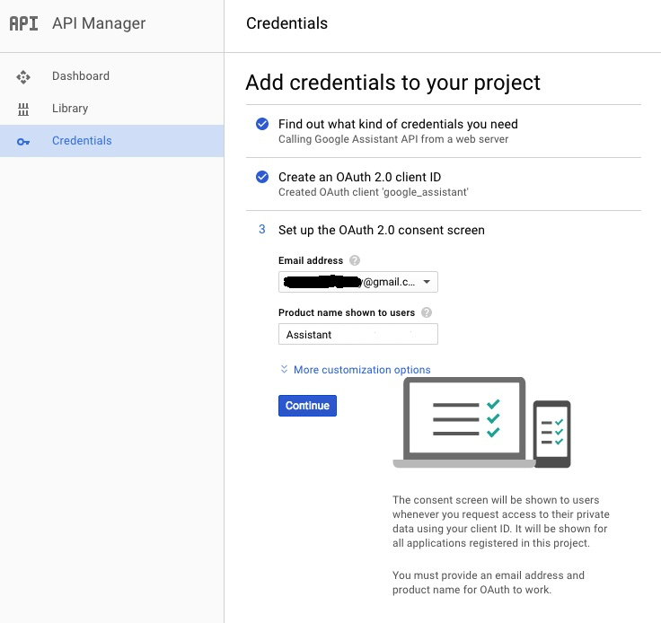

20. On the next page click on the Blue box text that says "Download"

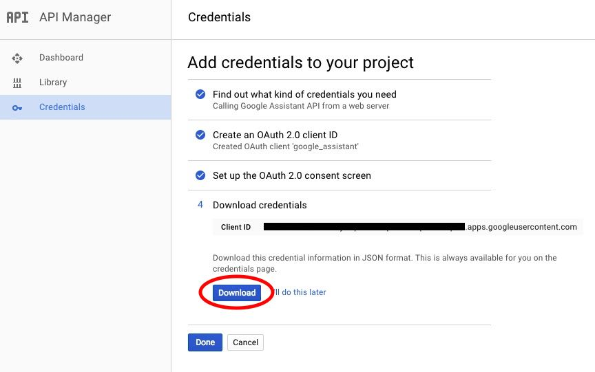

21. A menu will open to save the file. Rename the file so that it is called 

    ```
    client_secret.json
    ```

(HINT if your system does not show file name extensions and you do not see .json at the end of the existing filename then you do not need to add .json when renaming otherwise you will end up with client_secret.json.json which won't work!!)
Save it somewhere safe on your hardrive as we will need it later. NEVER SHARE THIS FILE WITH ANYONE AS IT CONTAINS YOUR AUTHENTICATION DETAILS

22. Click "Done" and a new page will appear. Click on the OAuth 2.0 client ID called "google_assistant"

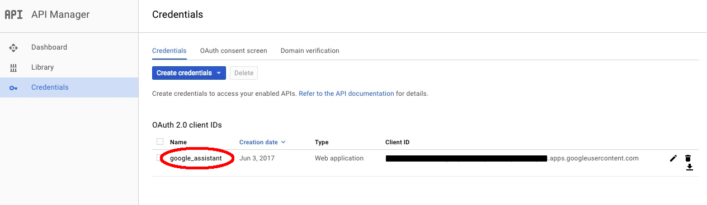

23. Copy the text in the Client ID box (excluding the Client ID text) and paste it into a new line in your Notepad/TextEdit document 

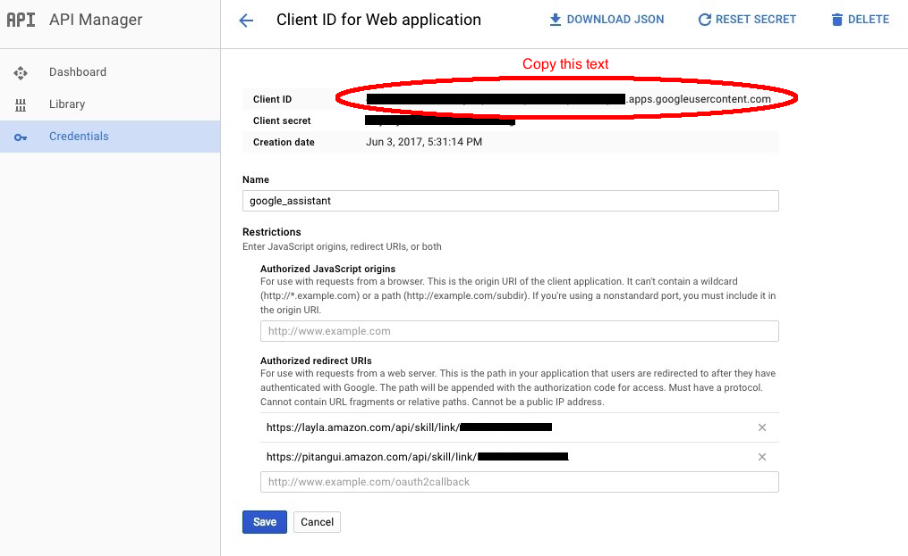

24. Copy the text in the Client Secret box (excluding the Client Secret text) and paste it into a new line in your Notepad/TextEdit document 

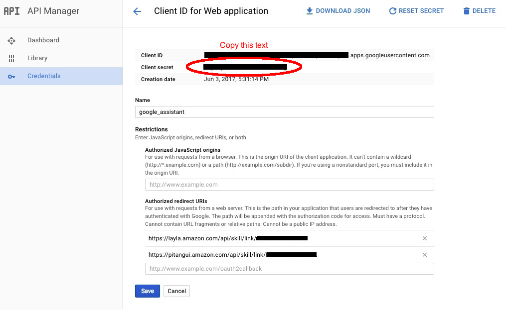

25. You can now close this tab/window

## AWS Lambda Setup

1. Go to http://aws.amazon.com/. You will need to set-up an AWS account if you don't have one already (the basic one will do fine). Make sure you use the same Amazon account that your Echo device is registered to. **Note - you will need a valid credit or debit card to set up an AWS account - there is no way around this. **
You may have to wait for then to authroise your card and then wait for an automated call so this may take 20 minutes or so)

2.  Go to the drop down "Location" menu at the top right and ensure you select US-East (N. Virginia) if you are based in North America or EU(Ireland) if you are based anywhere else. This is important as only these two AWS regions support Alexa.

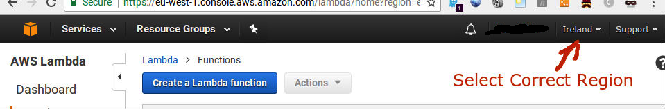

3. Click the AWS Services menu at the top left and then select "CloudFormation" from the "Management Tools" section

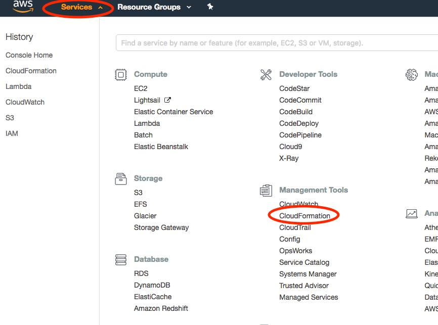

4. Click the blue button entitles "Create new stack"

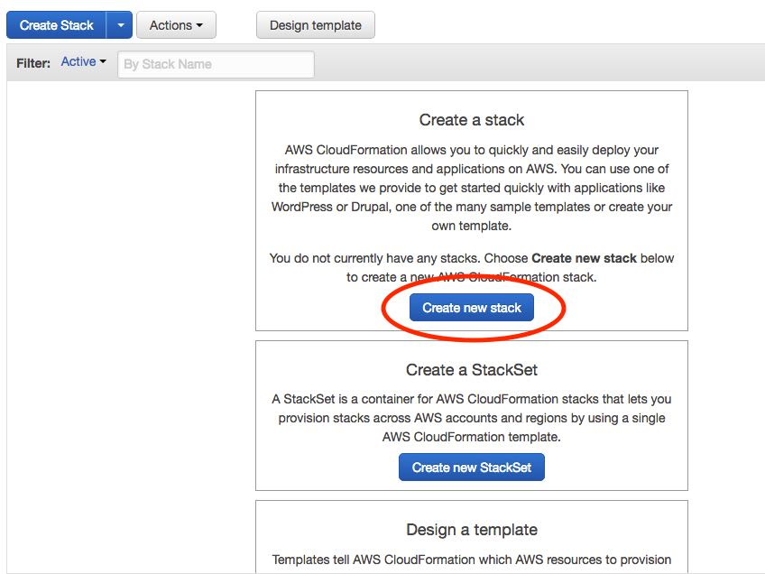

5. A new page will open titled "Select Template"
6. Under "Choose a template" select "Specify an Amazon S3 template URL" and paste the following into the box

    ```
    https://s3-eu-west-1.amazonaws.com/googleassistantskillcloudformationbucket/cloudformation.json
    ```
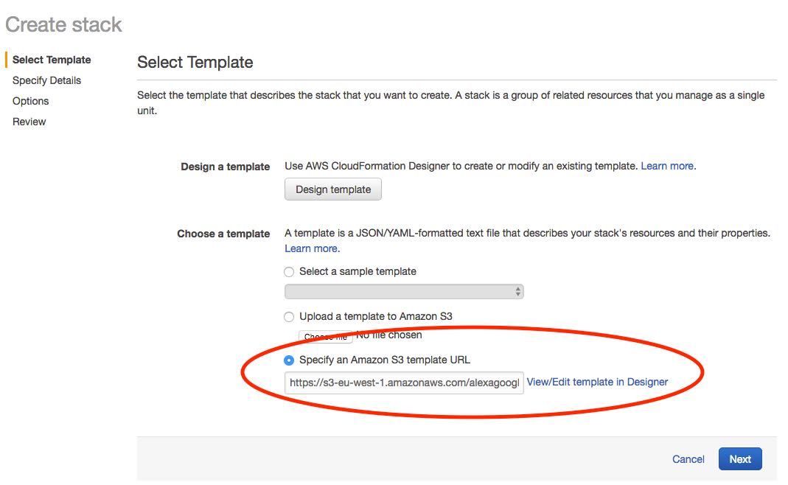

7. Click Next
8. On the "Specify Details" page call the "Stack Name":-

```
AlexaAssistant
```

10. Click Next
11. On the "Options" page do not change anything and just click on Next

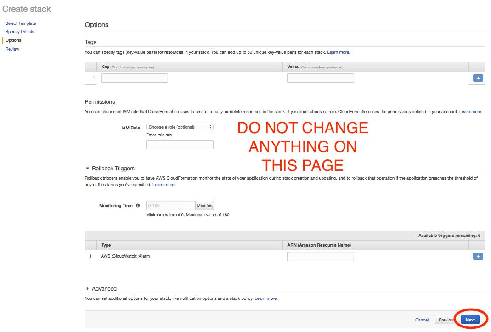

12. On the "Review" page click the box next to "I acknowledge that AWS CloudFormation might create IAM resources." 

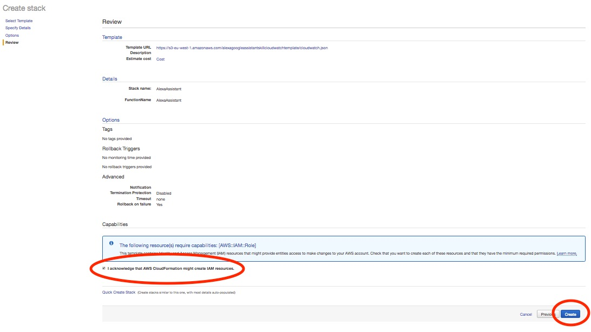

13. Click "Create" at the bottom right of the page

14. Cloudformation will then start to create the stack. THIS WILL TAKE SOME TIME SO I'D SUGGEST GOING TO MAKE A CUP OF TEA.

15. You can check progress by clicking on the refresh button towards the top right of the page


16. You will know that the creation process is complete as it will say "CREATE_COMPLETE" in green under the "Status" heading

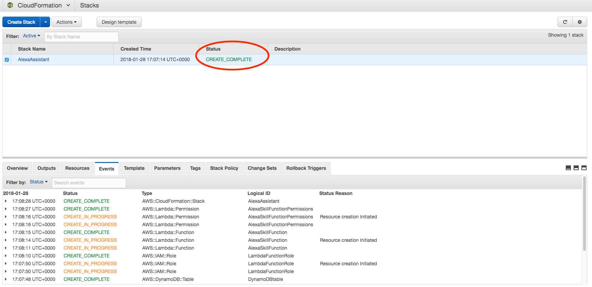

17. Click on the "Outputs" tab at the bottom of the page

18. If the creation process is very quick (less than 10 seconds) and the Ouput Tab looks like the one below then this means that you have selected the wrong AWS region. You will need to delete the CloudFormation Stack, select the right AWS region and then create the stack again. Instructions for deleting the stack are here:-

[How to delete the stack](delete_stack.md)

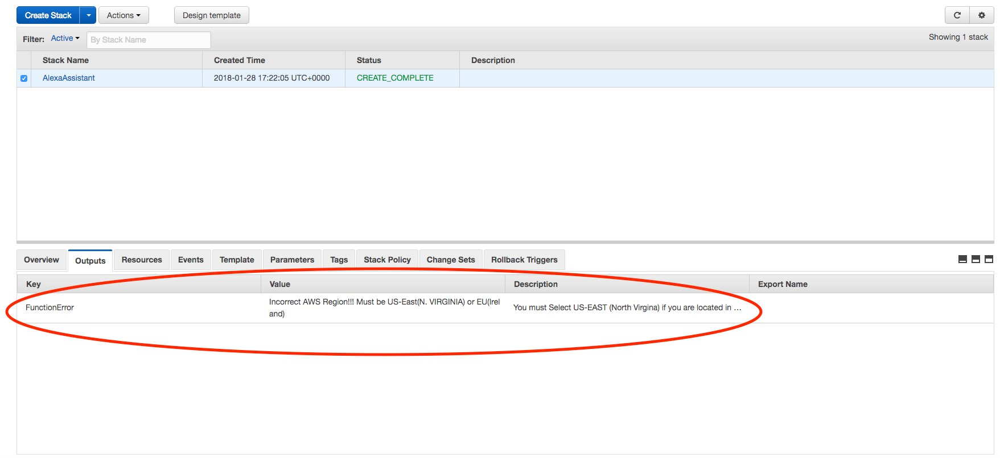

19. If you see the output below with the Key "FunctionARN", then select the text starting "arn:aws" (circled in green ins the screenshot) and copy it and paste it into your notepad document.

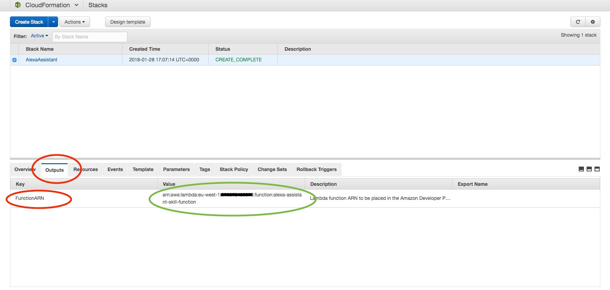

## Skill Setup Part 2

1. Return to the Skill setup page that we left earlier
2. Paste the FunctionARN text we copied from the previous step and paste into the "Default" box


2. In the Authorization URL paste the following: -

    ```
    https://accounts.google.com/o/oauth2/auth?access_type=offline
    ```
2. Delete the existing text from the "Client ID" field (it will probably say "alexa-skill")  
3. Copy the Client ID from your Notepad/TextEdit document (HINT - it's the longer of the two) and paste it into the Client ID box

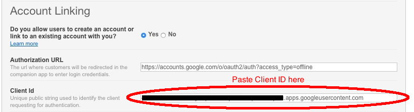

4. Under Domain List : Press "Add domain" and enter:-

    ```
    google.com
    ```

5. Press "Add domain" again for a second box into which enter:-

    ```
    googleapis.com
    ```

6. Under Scope: Press "Add Scope" and enter:-

    ```
    https://www.googleapis.com/auth/assistant-sdk-prototype
    ```
    
7. Press "add scope" again for a second box into which enter:-

    ```
    https://www.googleapis.com/auth/script.external_request
    ```
    
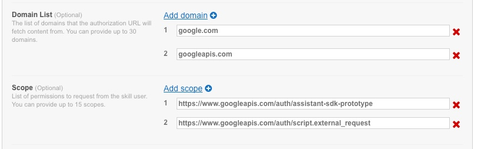

8. Under Authorisation Grant Type make sure "Auth Code Grant" is selected.
9. The Access Token URI should be set to: -
    
    ```
    https://accounts.google.com/o/oauth2/token
    ```

10. Copy the Client Secret from your Notepad/TextEdit document (HINT - it's the shorter of the two) and paste it into the Client Secret box
11. Leave Client Authentication Scheme as "HTTP Basic"
12. Leave eveything under Permission unselected.
13. Paste into the Privacy Policy URL box: -

    ```
    https://www.google.com/policies/privacy/
    ```
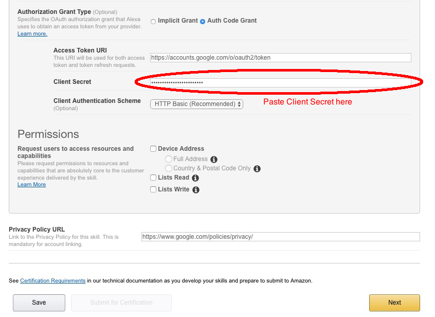    

14. Click "Save" and then "Next".

15. There is no need to go any further through the process i.e. submitting for certification. There is no point in testing the skill on the next page as the simulator cannot authenticate against the Google API. 

**You can now close this window/tab - makes sure you save your Notepad/TextEdit file somewhere safe in case you need these details again**


## Upload client_secret.json file to the S3 Bucket

1. Open a new browser window or tab
2. Goto to https://s3.console.aws.amazon.com/
3. You will see a list of S3 buckets (you might only have one if you haven't created any before).
4. Click on name of the the bucket with a name starting with (where XXXXXX will be some random characters)
    ```
    arn:aws:s3:::alexaassistant-s3bucket-XXXXXXX
    ```
    
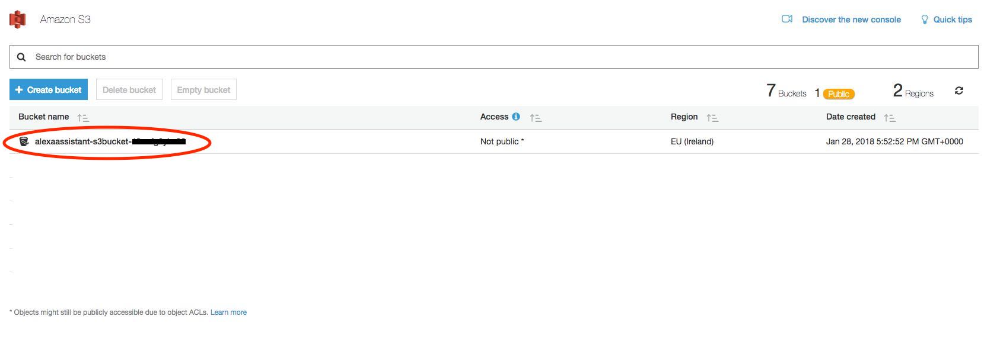
    
5. Click on the blue "Upload" button

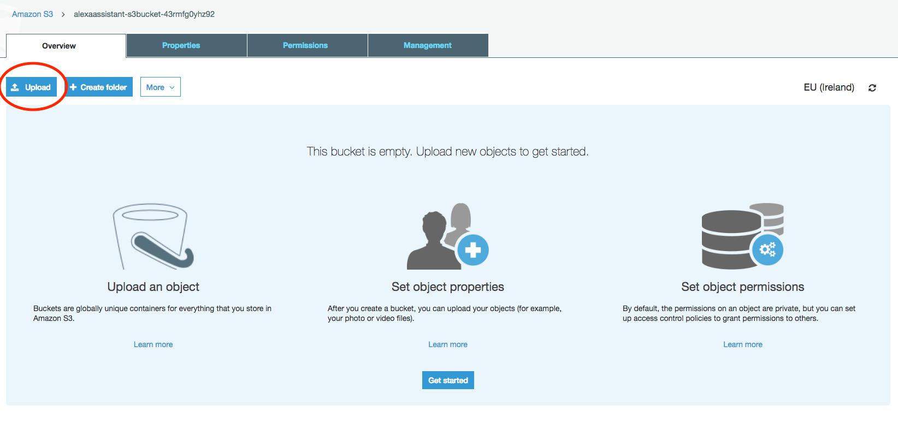

6. On the grey window that appears click on "Add files"

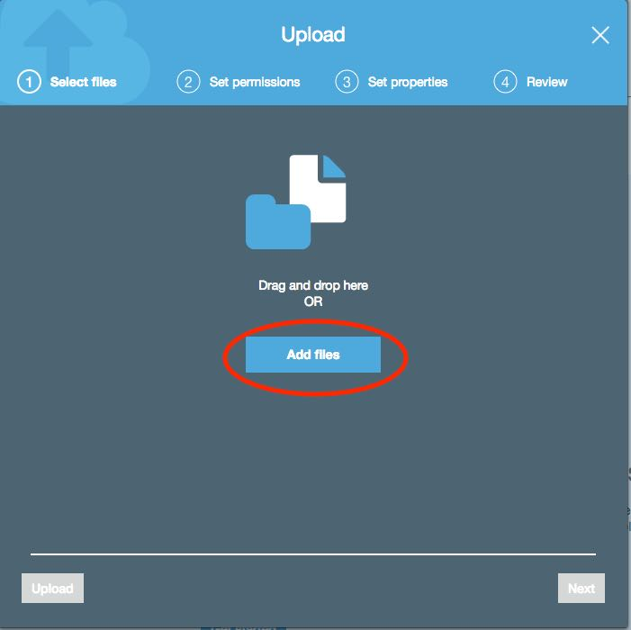

7. Select the client_secret.json file that you downloaded and renamed earlier (You did remember to rename it didn't you?)

8. On the next page *DO NOT CLICK NEXT* - Just click on the "Upload" button the the bottom left hand side

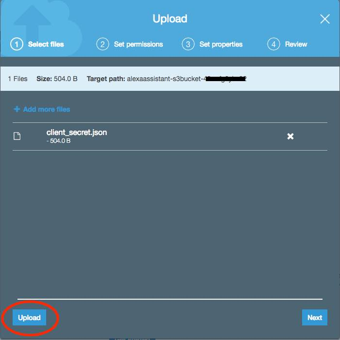

9. The grey window will now close and you should see a screen like below. You can now close this window/tab

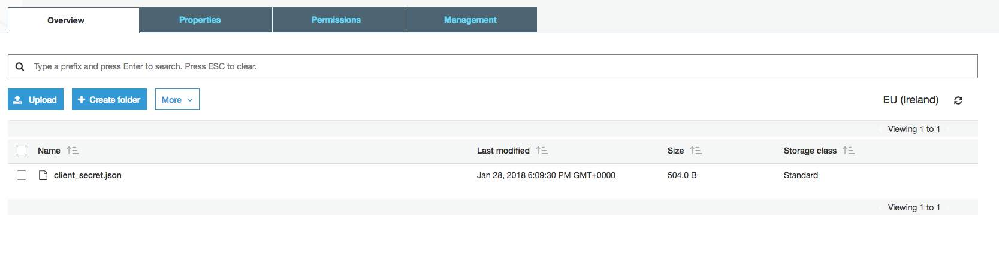


## Linking the skill to your Google Account

1. In order to use the Google Assistant, you must share certain activity data with Google. The Google Assistant needs this data to function properly; this is not specific to the SDK.

2. Open the Activity Controls page https://myaccount.google.com/activitycontrols for the Google account that you want to use with the Assistant. Ensure the following toggle switches are enabled (blue):

    1. Web & App Activity - Make sure the box marked "Include Chrome browsing history and activity from websites and apps that use Google Services" is also checked 
    2. Location History
    3. Device Information
    4. Voice & Audio Activity
    
3. Launch the Google skill by asking "Alexa, open google" (or whatever invocation name you gave e.g. "my assistant"
4. The skill will tell you if you have forgotten to set any environment variables or if there any other set-up issues
4. You will then be prompted to link your account through the Alexa app.
5. Select the Google account you want to use (the first time you run the skill it MUST be the one you authorised the API with) and then make sure you click "Allow" on the Google authorisation page. 


6. If you have problems linking through the IOS or Android app then please try the web based version of the Alexa app here:- http://alexa.amazon.com


## Change the language and location setting

1. The skill will default to US English and the Google Assistant will think you live in either West Virginia or Dublin depending on which AWS region you used

2. To change the language to another language and set your location you will need to have the very latest version of Google Assistant installed on your iOS or Android phone.

Using the Google Assistant App on your phone/tablet follow these instructions to set the language to German (the skill will be listed as "Alexa Assistant v1" in the devices section of settings):

https://developers.google.com/assistant/sdk/guides/assistant-settings

3. You will probably want to turn on the personal results option in the Assistant App as well

4. You should be good to go if not raise an issue


