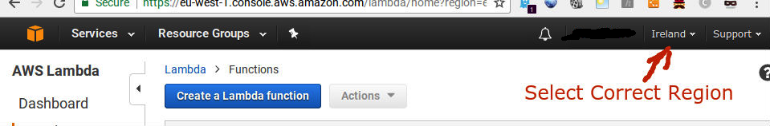
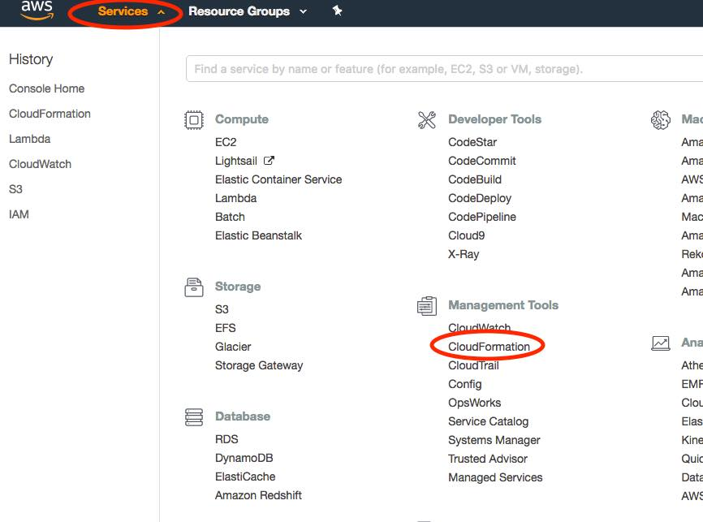
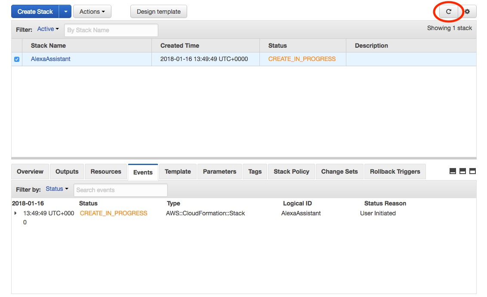
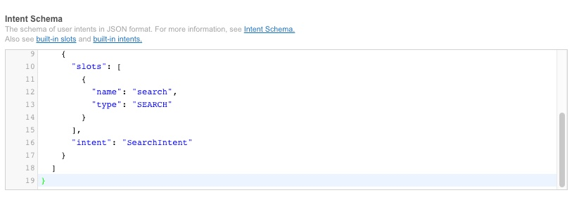
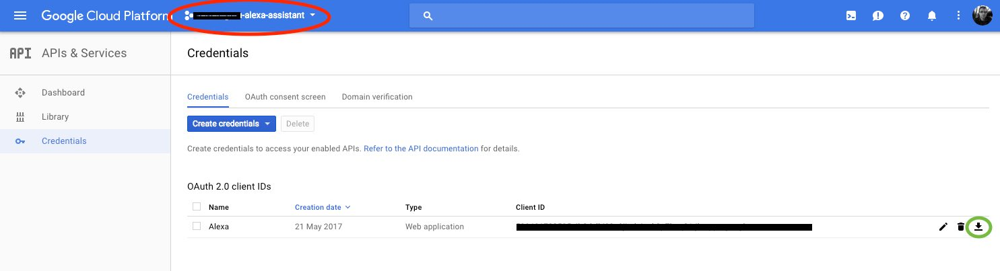
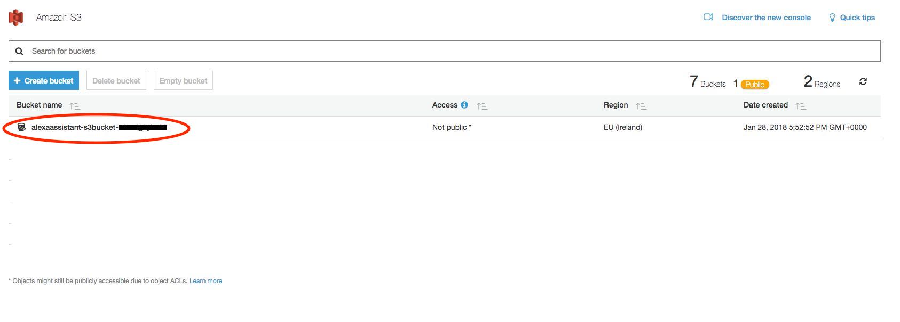
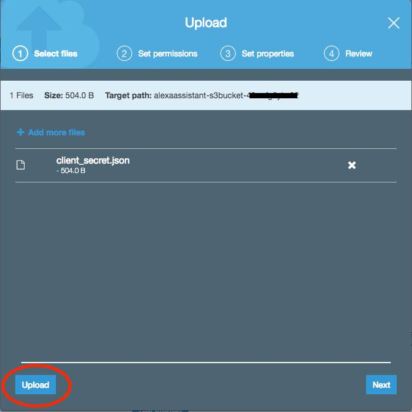

## Upgrade instructions

You must already have the previous version of skill installed. If you do not then please follow the fresh installation instructions here:-

[Installation Instructions](fresh_install.md)

Note - this manual upgrade is required so that the skill code is deployed via AWS CloudFormation. This will alow future upgrades to deployed vai a CloudFormation update

## MAKE SURE YOU DO THIS INSTALLATION ON A PC/MAC/LINUX MACHINE - A PHONE OR TABLET RUNNING iOS OR ANDROID WILL CAUSE ISSUES

# Licence for upgrade instructions

These upgrade instructions and the CloudFormation template linked to in these instructions (provided for users installing the lambda function) are licenced under a [Creative Commons Attribution-NonCommercial-NoDerivatives 4.0 International License](http://creativecommons.org/licenses/by-nc-nd/4.0/)

If you wish to reproduce the installation instructions hosted on your own website (**I really wish you wouldn't as it makes my life very difficult to support and update the skill**) then you may do so and link to my Cloudformation template (and consequently the zips on my S3 buckets)  provided that there is no monetisation on the page e.g. adverts. If you do wish to have monetisation then you will need to create your own instructions and host your own Cloudformation template and associated zip files. 

I AM VERY SERIOUS ABOUT THIS POINT - I WILL BE CHECKING FREQUENTLY AND WILL CHANGE OR REMOVE THE CLOUDFORMATION TEMPLATE URL IF PEOPLE ARE ABUSING IT

NOTE: I have granted Paul Hibbert the rights to link to the Cloudformation for the purposes of his installation videos

## Upgrade


## Delete the existing Google Assistant  Lambda Function
1. Goto your lambda function

https://eu-west-1.console.aws.amazon.com/lambda/home

2. Click on the circle next to the function called:

    ```
    Google Assistant
    ```
(You might have called it something different)


If you can't see your skill the go to drop down "Location" menu at the top right and ensure you select US-East (N. Virginia) if you are based in the US or EU(Ireland) if you are based in the UK or Germany.



3. Click on the "Actions" menu at the top right and select "Delete"


4. A warning box will appear. Click the orange "Delete" button


5. The function will be deleted

## Create a new lambda function


1. Click the AWS Services menu at the top left and then select "CloudFormation" from the "Management Tools" section



4. Click the blue button entitles "Create new stack"


5. A new page will open titled "Select Template"
6. Under "Choose a template" select "Specify an Amazon S3 template URL" and paste the following into the box

    ```
    https://s3-eu-west-1.amazonaws.com/googleassistantskillcloudformationbucket/cloudformation.json
    ```


7. Click Next
8. On the "Specify Details" page call the "Stack Name":-

```
AlexaAssistant
```

10. Click Next
11. On the "Options" page do not change anything and just click on Next


12. On the "Review" page click the box next to "I acknowledge that AWS CloudFormation might create IAM resources." 


13. Click "Create" at the bottom right of the page

14. Cloudformation will then start to create the stack. THIS WILL TAKE SOME TIME SO I'D SUGGEST GOING TO MAKE A CUP OF TEA.

15. You can check progress by clicking on the refresh button towards the top right of the page



16. You will know that the creation process is complete as it will say "CREATE_COMPLETE" in green under the "Status" heading


17. Click on the "Outputs" tab at the bottom of the page

18. If the creation process is very quick (less than 10 seconds) and the Ouput Tab looks like the one below then this means that you have selected the wrong AWS region. You will need to delete the CloudFormation Stack, select the right AWS region and then create the stack again. Instructions for deleting the stack are here:-

[How to delete the stack](delete_stack.md)


19. If you see the output below with the Key "FunctionARN", then select the text starting "arn:aws" (circled in green ins the screenshot) and copy it and paste it into a notepad document as we will need it later


## Update Existing Skill


1. Go to the Alexa developer console 

https://developer.amazon.com/edw/home.html

2. Click on the yellow "Get Started" button under Alexa Skills Kit.


3. Select the Google Assistant Skill that your previously created
4. Go to the Skill Information tab make sure "Render Template is set to Yes"


5. Click "Save" and then click "Next".


6. You will now be on the "Interaction Model" page.
7. Delete what is in the "Intent Schema" box and replace with the text below
    ```
    {
      "intents": [
        {
          "intent": "AMAZON.NavigateSettingsIntent"
        },
        {
          "intent": "AMAZON.MoreIntent"
        },
        {
          "intent": "AMAZON.PageDownIntent"
        },
        {
          "intent": "AMAZON.PageUpIntent"
        },
        {
          "intent": "AMAZON.ScrollRightIntent"
        },
        {
          "intent": "AMAZON.ScrollDownIntent"
        },
        {
          "intent": "AMAZON.ScrollLeftIntent"
        },
        {
          "intent": "AMAZON.ScrollUpIntent"
        },
        {
          "intent": "AMAZON.HelpIntent"
        },
        {
          "intent": "AMAZON.NextIntent"
        },
        {
          "intent": "AMAZON.PreviousIntent"
        },
        {
          "intent": "AMAZON.StopIntent"
        },
        {
          "intent": "AMAZON.CancelIntent"
        },
        {
          "intent": "AMAZON.NoIntent"
        },
        {
          "intent": "AMAZON.YesIntent"
        },
        {
          "slots": [
            {
              "name": "search",
              "type": "SEARCH"
            }
          ],
          "intent": "SearchIntent"
        }
      ]
    }
    ```



8. Leave the custom slots and sample utterance as per the previous version.
9. Click Save and then next once it has processed - Note if you are getting an error saying that the interaction model cannot be built then try adding a blank line to the sample utternaces. You can do this by putting the cursor to the end of the line that says "SearchIntent {search}" and pressing the return key. (This seems to be an Amazon issue). Try Saving the configuration as before. If this doesn't address the issue, then try adding a blank line to the Custom Slots by pressing the "Edit" button, adding a blank line as before, then press the "Edit" button and then Save.

10. On the Configuration Page, replace the exisitng Default Endpoint with the one you copied to your notepad file earlier.


11. Click Save and then Next
12. You will now be on "Test" Page. Press the orange Switch with "enabled" next to it so that it changes to "disabled" and then press it again so that it says "enabled"

## Get your Google Assistant API Credientials

1.Go to the Google API console here:-

https://console.cloud.google.com/apis/credentials

2. Make sure you have your Google Assistant Project Selected at the top of the page
3. Click on the download icon for the OAuth 2.0 Client ID that you previously created (highlighted in green on the screenshot below)



4. A menu will open to save the file. Rename the file so that it is called

    ```
    client_secret.json
    ```
(HINT if your system does not show file name extensions and you do not see .json at the end of the existing filename then you do not need to add .json when renaming otherwise you will end up with client_secret.json.json which won't work!!)
Save it somewhere safe on your hardrive as we will need it later. NEVER SHARE THIS FILE WITH ANYONE AS IT CONTAINS YOUR AUTHENTICATION DETAILS

You can now close this window

## Upload client_secret.json file to the S3 Bucket

1. Open a new browser window or tab
2. Goto to https://s3.console.aws.amazon.com/
3. You will see a list of S3 buckets
4. Find the bucket with the random 20 character name that you created for the skill originally and click on the bucket icon next to it's name
5. A box will open on the right hand side - ignore this and click on the "Delete bucket" button


6. A confirmation box will apear. Type in the name of the bucket (hint select the name from the warning above and copy and paste it) then press confirm


7. The bucket will be deleted and you will be taken back to a list of your other buckets,

8. Click on the name of the bucket with its name starting with (where XXXXXX will be some random characters)
    ```
    arn:aws:s3:::alexaassistant-s3bucket-XXXXXXX
    ```
    

    
9. Click on the blue "Upload" button


10. On the grey window that appears click on "Add files"


11. Select the client_secret.json file that you downloaded and renamed earlier (You did remember to rename it didn't you?)

12. On the next page *DO NOT CLICK NEXT* - Just click on the "Upload" button the the bottom left hand side



13. The grey window will now close and you should see a screen like below. You can now close this window/tab


14. Now Launch the skill by saying "Alexa, Open Google" - you will be asked to re-link your Google account

## Change the language and location setting

1. The skill will default to US English and the Google Assistant will think you live in either West Virginia or Dublin depending on which AWS region you used

2. To change the language to another language and set your location you will need to have the very latest version of Google Assistant installed on your iOS or Android phone.

Using the Google Assistant App on your phone/tablet follow these instructions to set the language to German (the skill will be listed as "Alexa Assistant v1" in the devices section of settings):

https://developers.google.com/assistant/sdk/guides/assistant-settings

3. You will probably want to turn on the personal results option in the Assistant App as well

4. You should be good to go if not raise an issue
