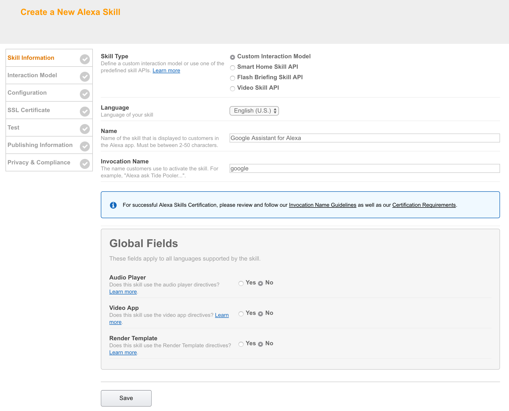

# alexa-assistant

Implementation of the Google Assistant API for Alexa

# Beta Release 2.05

Supports the new Assistant SDK
Adds support for languages other than US English
Adds suppurt for Echo Show


### THIS SKILL IS FOR PERSONAL USE ONLY AND IS NOT ENDORSED BY GOOGLE OR AMAZON. WHILST THIS SKILL USES AN OFFICIAL GOOGLE API, IT WILL NEVER PASS AMAZON CERTIFICATION DUE TO THE WAY THE RESPONSES ARE HOSTED.

This is a beta release for testing and is only available as an upgrade to the existing version at this time.


You must already have the skill installed. Inorder to upgarde to thus version you will need  to:-

## Download code from GitHub

1. Click on the green "Clone or download" button just under the yellow bar.
2. Click Download ZIP.
3. Unzip the file (it will be called alexa-assistant-master.zip) to a known place on your hard-drive (suggest root of C: drive in Windows to avoid problems with long filenames).

## Update AWS Lambda Function
2. Goto your lambda function

https://eu-west-1.console.aws.amazon.com/lambda/home

2. Open the function called

    ```
    Google Assistant
    ```

If you can't see your skill the go to drop down "Location" menu at the top right and ensure you select US-East (N. Virginia) if you are based in the US or EU(Ireland) if you are based in the UK or Germany.


2. Scroll down the page to the 'Function code' section and click on the "Upload" button. Go to the folder where you unzipped the files you downloaded from GitHub, select index.zip and click open. Do not upload the alexa-assistant-master.zip you downloaded from GitHub - only the index.zip contained within it.


2.  In the section below called 'Environment Variables create a new lambda function Environment Variable called "PROJECT_ID". The value of this environment variable must be the ID of the Google Project that you created in the API console. You can get to your project via this link (you will probably only have one project): 

https://console.cloud.google.com/cloud-resource-manager


2. Click on the orange "Save" button at the top right of the page. This will upload the index.zip file to Lambda. This may take a number of minutes depending on your connection speed. **NOTE - If the creation process takes more than five minutes or produces an error similar to "Signature expired: 20170612T135832Z is now earlier than 20170612T142721Z (20170612T143221Z - 5 min.)" then this is due to having a slow internet upload speed.  You'll need to upload the zip file via S3 instead. Go here:- https://console.aws.amazon.com/s3/home. Create a bucket - call it whatever you want. You can then upload the index.zip to that S3 bucket. Once it's uploaded use the "Upload a file from S3" rather than the "Upload a zip " option in the Lambda setup.**

3. Go to the Alexa developer console 

https://developer.amazon.com/edw/home.html

3. Click on the yellow "Get Started" button under Alexa Skills Kit.


4. Select the Google Assistant Skill that your previously created
5. Go to the Skill Information tab make sure "Render Template is set to Yes"


9. Click "Save" and then click "Next".



10. You will now be on the "Interaction Model" page.
11. Delete what is in the "Intent Schema" box and replace with the text below
    ```
    {
      "intents": [
        {
          "intent": "AMAZON.NavigateSettingsIntent"
        },
        {
          "intent": "AMAZON.MoreIntent"
        },
        {
          "intent": "AMAZON.PageDownIntent"
        },
        {
          "intent": "AMAZON.PageUpIntent"
        },
        {
          "intent": "AMAZON.ScrollRightIntent"
        },
        {
          "intent": "AMAZON.ScrollDownIntent"
        },
        {
          "intent": "AMAZON.ScrollLeftIntent"
        },
        {
          "intent": "AMAZON.ScrollUpIntent"
        },
        {
          "intent": "AMAZON.HelpIntent"
        },
        {
          "intent": "AMAZON.NextIntent"
        },
        {
          "intent": "AMAZON.PreviousIntent"
        },
        {
          "intent": "AMAZON.StopIntent"
        },
        {
          "intent": "AMAZON.CancelIntent"
        },
        {
          "intent": "AMAZON.NoIntent"
        },
        {
          "intent": "AMAZON.YesIntent"
        },
        {
          "slots": [
            {
              "name": "search",
              "type": "SEARCH"
            }
          ],
          "intent": "SearchIntent"
        }
      ]
    }
    ```


7. Leave the custom slots and sample utterance as per the previous version.
8. Click Save and then next once it has processed

9. Open the skill once by asking 'Alexa Open Google' (or whatever you have called the skill). This may take some time as it needs to do some on-time setup in the background. If it all works then the skill will respond in US English.
10. To change the language to UK English and set your location you will need to have the very latest version of Google Assistant installed on your iOS or Android phone. Follow these instructions to set the language to German (the skill will be listed as "Alexa Assistant v1" in the devices section of settings):

https://developers.google.com/assistant/sdk/guides/assistant-settings

12. You will probably want to turn on the personal results option in the Assistant App as well
11. You should be good to go if not raise an issue
