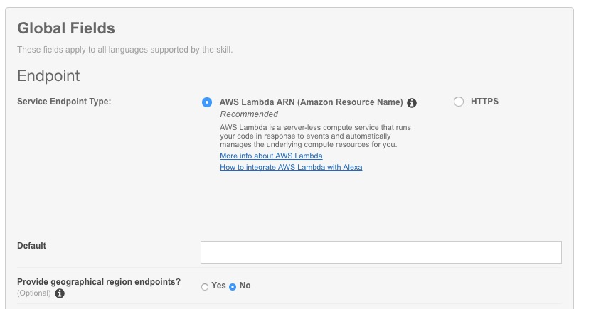
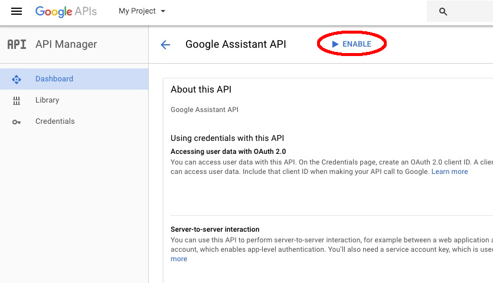
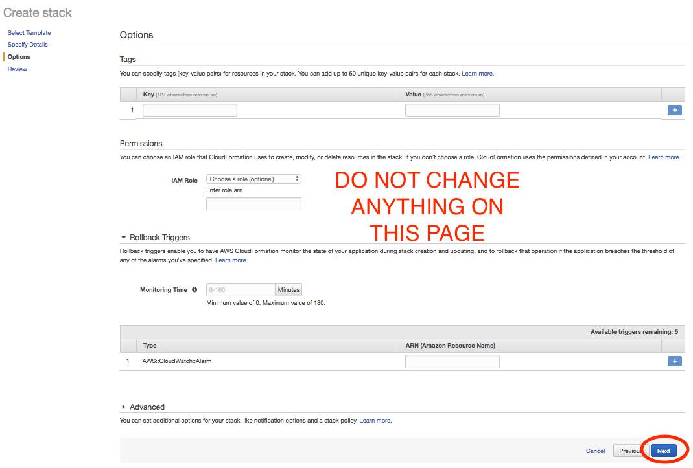

# alexa-assistant

Implementation of the Google Assistant API for Alexa

# Beta Release 2.1

### THIS SKILL IS FOR PERSONAL USE ONLY AND IS NOT ENDORSED BY GOOGLE OR AMAZON. WHILST THIS SKILL USES AN OFFICIAL GOOGLE API, IT WILL NEVER PASS AMAZON CERTIFICATION DUE TO THE WAY THE RESPONSES ARE HOSTED.

This is a beta release for testing 

# Upgrade instructions

If you already have a previous version of the skill installed then please read the upgrade instructions here:-

[Upgrade Instructions](other_file.md)

# New Installation

1. In a new browser tab/window go to https://developer.amazon.com/alexa
1. Click on the "Your Alexa Dashboards" at the top right of the screen


1. You will see an Amazon Login. If you already have an Amazon Developer account then login otherwise press the "Create your Amazon Developer account" button


1. If you need to create a Developer account then fill in your details and ensure you answer "NO" for "Do you plan to monetize apps by charging for apps or selling in-app items" and "Do you plan to monetize apps by displaying ads from the Amazon Mobile Ad Network or Mobile Associates?"


1. Once you are logged into your account click on the yellow "Get Started" button under Alexa Skills Kit.


3. Click the "Add a New Skill" yellow box towards the top right.


4. You will now be on the "Skill Information" page.
5. Set "Custom Interaction Model" as the Skill type
6. Select the correct langauge for your country (THIS IS IMPORTANT AS OTHERWISE THE SKILL WILL NOT LAUNCH)
6. Set the "Name" to 

    ```
    Google Assistant for Alexa
    ```
    
8. You can set the "Invocation Name" to whatever you want although some names work better than others. I have found that "google" or "my assistant" seem to work well. The name you choose will be the activation name e.g. "Alexa, ask my assistant how long will it take to drive to London?". For these instructions we will set "google" as the invocation name, so in this case you would say: "Alexa, Ask google who is the queen of england". For best results the invocation name should be lowercase **NOTE - if you have already installed my previous Google Skill and have used the "google" invocation name for this then you will either have to use a different invocation name for this skill or rename/delete the older Google skill.**

8. Under the Global Fields section, set the "Render Template" option to Yes. Leave all other settings to No
9. Click "Save" and then click "Next".


10. You will now be on the "Interaction Model" page.
11. Ignore the box lablled "Built-in intents for render template control"


11. Copy the text below into the "Intent Schema" box.

    ```
    {
      "intents": [
        {
          "intent": "AMAZON.NavigateSettingsIntent"
        },
        {
          "intent": "AMAZON.MoreIntent"
        },
        {
          "intent": "AMAZON.PageDownIntent"
        },
        {
          "intent": "AMAZON.PageUpIntent"
        },
        {
          "intent": "AMAZON.ScrollRightIntent"
        },
        {
          "intent": "AMAZON.ScrollDownIntent"
        },
        {
          "intent": "AMAZON.ScrollLeftIntent"
        },
        {
          "intent": "AMAZON.ScrollUpIntent"
        },
        {
          "intent": "AMAZON.HelpIntent"
        },
        {
          "intent": "AMAZON.NextIntent"
        },
        {
          "intent": "AMAZON.PreviousIntent"
        },
        {
          "intent": "AMAZON.StopIntent"
        },
        {
          "intent": "AMAZON.CancelIntent"
        },
        {
          "intent": "AMAZON.NoIntent"
        },
        {
          "intent": "AMAZON.YesIntent"
        },
        {
          "slots": [
            {
              "name": "search",
              "type": "SEARCH"
            }
          ],
          "intent": "SearchIntent"
        }
      ]
    }
    ```


12. Under Custom Slot Types:-
13. Type into the "Enter Type" field (NOTE - this is capitalised) :-
    ```
    SEARCH
    ```
    
14. Copy the text below and paste into the "Enter Values" box and then click "Add"

    ```
    who is the queen
    why is the sky blue
    ```


15. Copy the text below and paste them into the Sample Utterances box.

    ```
    SearchIntent {search}
    ```
 

16. Click "Save" and then "Next".
17. You will now be on the "Configuration" page.
18. Select "AWS Lambda ARN (Amazon Resource Name)" for the skill Endpoint Type.
19. Leave the "Default" box empty for the moment
19. Leave "Provide geographical region endpoints?" set to "No"

 

20. Select "Yes" for Account Linking

At this point we will pause the setup of the skill and setup the google API. Copy the  Redirect URLs lower down the page you are currently on (there will be a number of these the first should start https://layla.amazon.com/api/skill/link the secondhttps://pitangui.amazon.com/api/skill/link - see screenshot below) and paste them into a Notepad document on windows or TextEdit on mac. We will need these during the setup of the Google API and later on in the setup of the Lambda function


**Leave this page open as we will come back to it after we have setup the Google Assistant API**

### Enable Google Assistant API:-
To enable access to the Google Assistant API, do the following:

1. In a **new** browser tab or window, go to the Cloud Platform Console here https://console.cloud.google.com/project (If this is the first time you have use the google developer console then you will need to agree to the Terms of service on the pop-up box.)


2. Click on "Select a project" and then the "+" button to create a new project


3. Give the project a name, it doesn't really matter what it is but it needs to be unique so Google will add a series of numbers to the end of the name if somebody has already used it. Press create.
4. You will be taken to a new page. It will take about 15 seconds for the project to be created. Look for a notification within the blue bar at the top of the page. Once the project is created click on the notification and then select the "Create Project: XXX" where XXX is the name that you gave the project.


5. Click on this link: - https://console.developers.google.com/apis/api/embeddedassistant.googleapis.com/overview This will take you to a page entitled "API manager".
6. Click on the blue text near the top that says "ENABLE".



7. Once the next page had loaded - click on "Create Credentials"


8. Make sure "Google Assistant API" is selected under "Which API are you using?"
9. Under "Where will you be calling the API from?" select "Web server (e.g. node.js, Tomcat)
9. Under "What data will you be accessing?" select "User data".
9. Click on the blue "What credentials do I need?" button.


10. On the next page set the Name to :-

    ```
    google_assistant
    ```
    
10. Under Authorised redirect URIs, paste the first of the "Redirect URLS" from the skill setup page and hit "Enter"
11. A second box will appear - into this paste the second "Redirect URL" and then hit "Enter" again
11. Continue this process untill all redirect URLs than you copies from the skill setup have been entered
12. Click the blue "Create client ID" button.


13. On the next page the Email address field should auto populate with your Google account email address
14. In the "Product name shown to users" enter:-

    ```
    Assistant
    ```

15. Click on the blue "Continue" button.


16. On the next page click on the Blue box text that says "Download"


17. A menu will open to save the file. Rename the file so that it is called

    ```
    client_secret.json
    ```
and save it somewhere safe on your hardrive as we will need it later. NEVER SHARE THIS FILE WITH ANYONE AS IT CONTAINS YOUR AUTHENTICATION DETAILS

18. You can now close this tab/window

## AWS Lambda Setup

Go to http://aws.amazon.com/. You will need to set-up an AWS account (the basic one will do fine) if you don't have one already. Make sure you use the same Amazon account that your Echo device is registered to. **Note - you will need a valid credit or debit card to set up an AWS account - there is no way around this. **

2.  Go to the drop down "Location" menu at the top right and ensure you select US-East (N. Virginia) if you are based in North America or EU(Ireland) if you are based anywhere else. This is important as only these two AWS regions support Alexa.


3. Click the AWS Services menu at the top left and then select "CloudFormation" from the "Management Tools" section


4. Click the blue button entitles "Create new stack"


5. A new page will open titled "Select Template"
6. Under "Choose a template" select "Specify an Amazon S3 template URL and past the following into the box

    ```
    https://s3-eu-west-1.amazonaws.com/googleassistantskillcloudformationbucket/cloudformation.json
    ```


7. Click Next
8. On the "Specify Details" page call the "Stack Name":-

```
AlexaAssistant
```
9. The "FunctionName" under "Parameters" should also be set to
```
AlexaAssistant
```


10. Click Next
11. On the "Options" page do not change anything and just click on Next



12. On the "Review" page click the box next to "I acknowledge that AWS CloudFormation might create IAM resources." 

13. Click "Create" at the bottom right of the page

14. Cloudformation will then start to create the stack. THIS WILL TAKE SOME TIME SO I'D SUGGEST GOING TO MAKE A CUP OF TEA.

15. You can check progress by clicking on the refresh button towards the top right of the page


