# alexa-assistant

Implementation of the Google Assistant API for Alexa

# Beta 2

# THIS IS AN UNSTABLE DEVELOPMENT BRANCH - PLEASE DO NOT INSTALL THIS VERSION UNLESS YOU HAVE BEEN ASKED TO AS IT IS WORK IN PROGRESS! 

This BETA 2 version contains the following changes: -

1. Automatic set-up of S3 bucket and upload of chime mp3
2. changed response and chime mp3 file names to use random string from bucket name
3. Applied a 50% increase in gain on responses
4. Simplified installation process

### THIS SKILL IS FOR PERSONAL USE ONLY AND IS NOT ENDORSED BY GOOGLE OR AMAZON - DO NOT SUBMIT THIS TO AMAZON FOR CERTIFICATION AS IT WON'T PASS!

This skill is an implementation of the official Google Assistant API wrapped as an Alexa skill. It supports all the functions that the API offers (which is slightly different from the Google Home). It is limited to 500 requests a day and only supports US English (although it is usable in the UK)

The following features are **NOT** supported: -

1. Alarms and timers.
2. Device location. If you have a Home address set in your google account then it will use that as a default
3. Playing music, news, or podcasts is not yet supported.
4. Account linking for third party services requires owning a Google Home and installing the Google Home application. This affects using services like Uber, or connecting to home automation devices like Hue.


**Known issues:-**

1. If you unlink the skill to your account and then re-enable it then the skill might keep asking for you to re-link every hour. You can resolve this by going to this page and removing the Alexa Skill https://myaccount.google.com/permissions?pli=1. You should then be able to relink the skill permanently.

2. You will need to give Google Assistant access to the following features on your Google account. If you do not give access to these then the skill will not work (This is a Google policy not mine). If you are concerned, then you could use a new google account just for this skill and not login using this account elsewhere

    1. Web & App Activity
    2. Location History
    3. Device Information
    4. Voice & Audio Activity
    
4. Shopping lists are supported - you will need to use the Google Express app to see them, or if you are not in the US or don't want to use the app then you can access the shopping list here: - https://www.google.com/express/shoppinglist/

5. Recognition accuracy and response time. The Google Assistant API only supports voice input and Alexa only makes the text of a spoken enquiry available to a skill. Therefore the skill has to take the text recognised by Alexa, convert it to speech and then send this to Google. This takes time and can potentially reduce accuracy - there isn't much that can be done about this unless Google opens up a text interface or Amazon allow access to the raw audio from the Alexa request.

6. The Google API only supports the US version of the Google Assistant and is US English only, however it will still work in other countries. Local services *should* work if you set a home/work addresses in your google account as per the instructions here:- https://support.google.com/maps/answer/3093979?co=GENIE.Platform%3DDesktop&hl=en
    

### PRIVACY WARNING. IN ORDER FOR THIS SKILL TO WORK THE LAST RESPONSE FROM GOOGLE MUST BE MADE AVAILABLE AS A PUBLICLY ACCESSIBLE MP3 FILE. THIS IS STORED IN AN AWS S3 BUCKET UNDER YOUR CONTROL AND IT IS GIVEN A RANDOMISED NAME TO MINIMISE THE CHANCES OF SOMEONE STUMBLING ON IT. IF THIS IS NOT ACCEPTABLE TO YOU THEN PLEASE DO NOT INSTALL THIS SKILL!!! SEE S3

## Credits

Richard Vowles for his TypeScript Google Assistant client which gave me some pointers on getting the API running in pure node.js https://github.com/rvowles/node-assistant

John JDuo and Pete Bready for proof reading these installation instructions


## Setup

To run the skill you need to do a number of things: -

1. download the file from github 
4. deploy the example code in lambda
5. configure the Alexa skill to use Lambda.
6. get an API key from Google
7. link skill to your Google Account

### Download code from github

1. Click on the green "Clone or download" button just under the yellow bar
2. Click download ZIP
3. Unzip the file to a known place on your hard-drive (suggest root of C: drive in Windows to avoid problems with long filenames)

### AWS Lambda Setup

1. Go to http://aws.amazon.com/. You will need to set-up an AWS account (the basic one will do fine) if you don't have one already ** Make sure you use the same Amazon account that your Echo device is registered to** Note - you will need a credit or debit card to set up an AWS account - there is no way around this. If you are just using this skill then you are highly unlikely to be charged unless you are making at least a million requests a month!
2.  Go to the drop down "Location" menu at the top right and ensure you select US-East (N. Virginia) if you are based in the US or EU(Ireland) if you are based in the UK or Germany. This is important as only these two regions support Alexa. NOTE: the choice of either US or EU is important as it will affect the results that you get. The EU node will provide answers in metric and will be much more UK focused, whilst the US node will be imperial and more US focused.

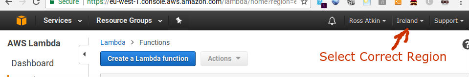

1. Select Lambda from the AWS Services menu at the top left
2. Click on the "Create a Lambda Function" or "Get Started Now" button.
3. Select "Blank Function" - this will automatically take you to the "Configure triggers" page.

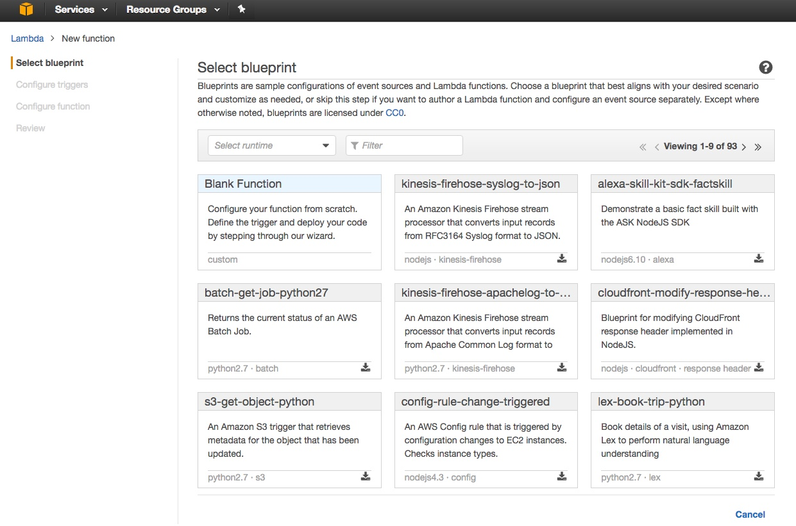

4. Click the dotted box and select "Alexa Skills Kit" (NOTE - if you do not see Alexa Skill Kit as an option then you are in the wrong AWS region). 

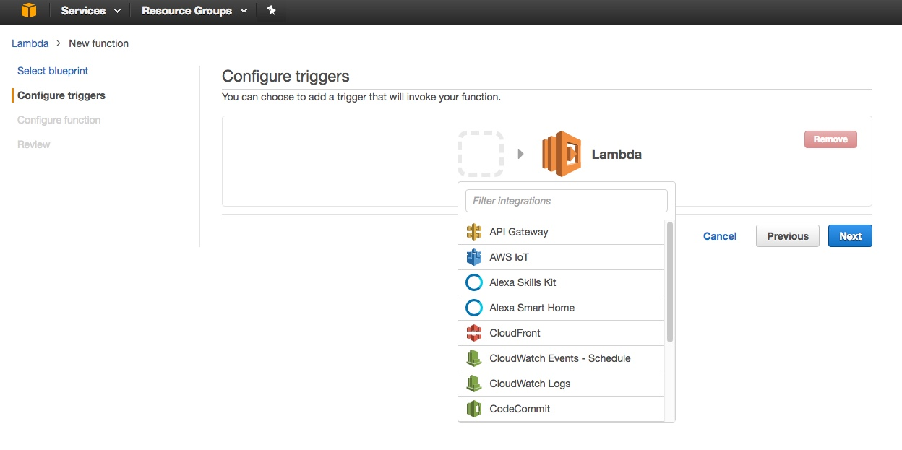

5. Click Next 

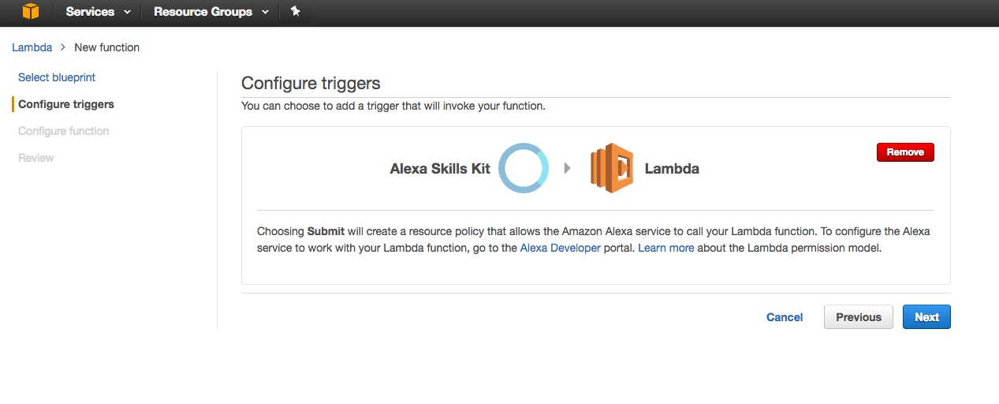

5. Name the Lambda Function :-

    ```
    google-assistant
    ```
    
5. Set the decription as :-

    ```
    Google Assistant
    ```
    
6. Select the default runtime which is currently "node.js 6.10".
7. Select Code entry type as "Upload a .ZIP file". 

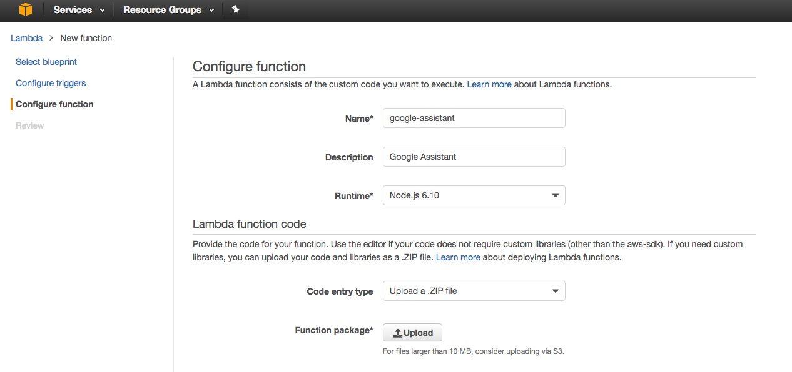

7. Click on the "Upload" button. Go to the folder where you unzipped the files you downloaded from Github, select index.zip and click open. Do not upload the zip file you downloaded from Github - only the index.zip contained within it.

7. You will need to create a random string to act as the name of the Amazon S3 bucket that will be used to store the MP3 response from the Google Assistant (see security note at the start of this readme). Open this page in a new tab or window and copy the random string that it produces: https://www.random.org/strings/?num=1&len=20&digits=on&loweralpha=on&unique=on&format=html&rnd=new.

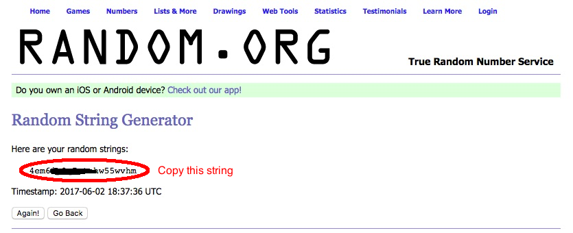

8. Enter the following into the Environment Variables Section: -

|Key           | Value|
|--------------| -----|
|S3_BUCKET|(paste in the random string from the previous step in here)|
|CLIENT_SECRET|(leave blank for the moment)|
|CLIENT_ID |(leave blank for the moment)|
|API_ENDPOINT|embeddedassistant.googleapis.com|
|REDIRECT_URL|(leave blank for the moment)|

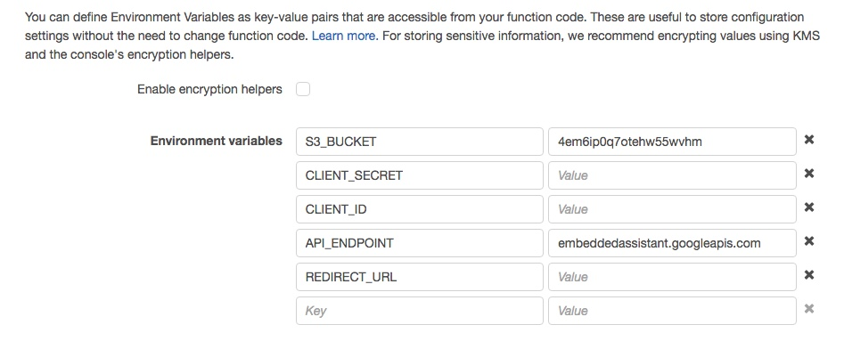 

9. Keep the Handler as "index.handler" (this refers to the main js file in the zip).
10. Under Role - select "Create a custom role". This will automatically open a new browser tab or window

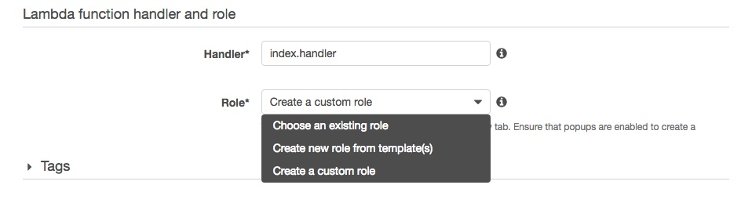

11. Switch to this new tab or window. 
11. Under IAM Role select "Create a new IAM Role"
11. Call the Role Name:-

    ```
    google_assistant
    ```

11. Click on "Hide Policy Document" - a grey box will appear

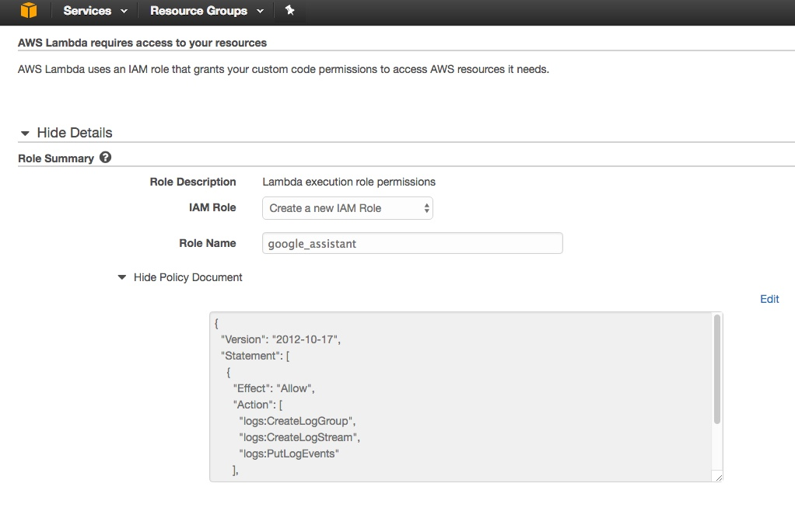

11. Click on "Edit" to the right hand side of the grey box
11. A warning message will appear - click "Ok"

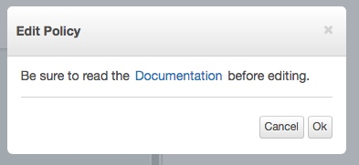

11. Delete **ALL** the text in the box and paste in the following: -

    ```
    {
        "Version": "2012-10-17",
        "Statement": [
            {
                "Effect": "Allow",
                "Action": [
                    "logs:CreateLogGroup",
                    "logs:CreateLogStream",
                    "logs:PutLogEvents"
                ],
                "Resource": [
                    "arn:aws:logs:*:*:*",
                    "arn:aws:lambda:*:*:*"
                ]
            },
            {
                "Effect": "Allow",
                "Action": [
                    "polly:SynthesizeSpeech"
                ],
                "Resource": [
                    "*"
                ]
            },
            {
                "Effect": "Allow",
                "Action": "s3:*",
                "Resource": "*"
            },
            {
                "Effect": "Allow",
                "Action": "dynamodb:*",
                "Resource": "*"
            }
        ]
    }
    ```
11. Then press the blue "Allow" box at the bottom right hand corner. The tab/window will automatically close.
11. You should now be back on the Lambda Management page. The Role box will have automatically changed to "Choose an existing role" and Role we just created will be selected under the "Existing role" box.

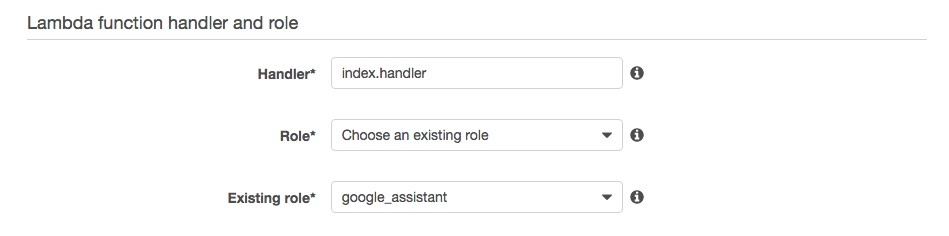

12. Under Advanced Settings set Memory (MB) to 1536 and change the Timeout to 12 seconds

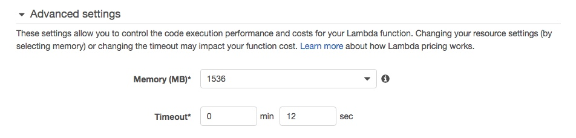

13. Click on the blue "Next" at the bottom of the page and review the settings then click "Create Function". This will upload the Archive.zip file to Lambda. This may take a number of minutes depending on your connection speed

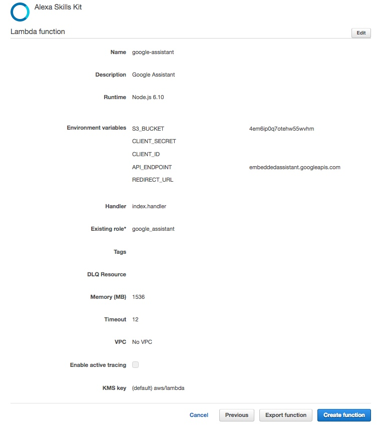

14. Copy the ARN from the top right to be used later in the Alexa Skill Setup (it's the text after ARN - it won't be in bold and will look a bit like this arn:aws:lambda:eu-west-1:XXXXXXX:function:google-assistant). Hint - Paste it into notepad or similar.

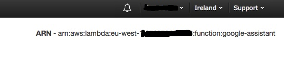

**Leave this tab/window OPEN as we will need to return to it to set some further environment variable values**

### Alexa Skill Setup (Part 1)

**NOTE - if you have already installed my previous Google Skill and have used the "google" invocation name for this then you will either have to use a different invocation name for this skill or rename/delete the older Google skill**

1. In a new browser tab/window go to the Alexa Console (https://developer.amazon.com/edw/home.html and select Alexa on the top menu)
1. If you have not registered as an Amazon Developer then you will need to do so. Fill in your details and ensure you answer "NO" for "Do you plan to monetize apps by charging for apps or selling in-app items" and "Do you plan to monetize apps by displaying ads from the Amazon Mobile Ad Network or Mobile Associates?


1. Once you are logged into your account go to to the Alexa tab at the top of the page
2. Click on the yellow "Get Started" button under Alexa Skills Kit


3. Click the "Add a New Skill" yellow box towards the top right


4. You will now be on the "Skill Information" page.
5. Set "Custom Interaction Model" as the Skill type
6. Select the language as English (US), English (UK), or German depending on your location
6. Set the "Name" to 

    ```
    Google Assistant for Alexa
    ```
    
8. You can set the "Invocation Name" to whatever you want although some names work better than others. I have found that "google" or "my assistant" seem to work well. The name you choose will be the activation name e.g. "Alexa, ask my assistant how long will it take to drive to London?". For these instructions we will set "google" as the invocation name, so in this case you would say: "Alexa, Ask google who is the queen of england". For best results the invocation name should be lowercase **NOTE - if you have already installed my previous Google Skill and have used the "google" invocation name for this then you will either have to use a different invocation name for this skill or rename/delete the older Google skill.**

8. Leave the "Audio Player" setting to "No"
9. Click "Save" and then click "Next".

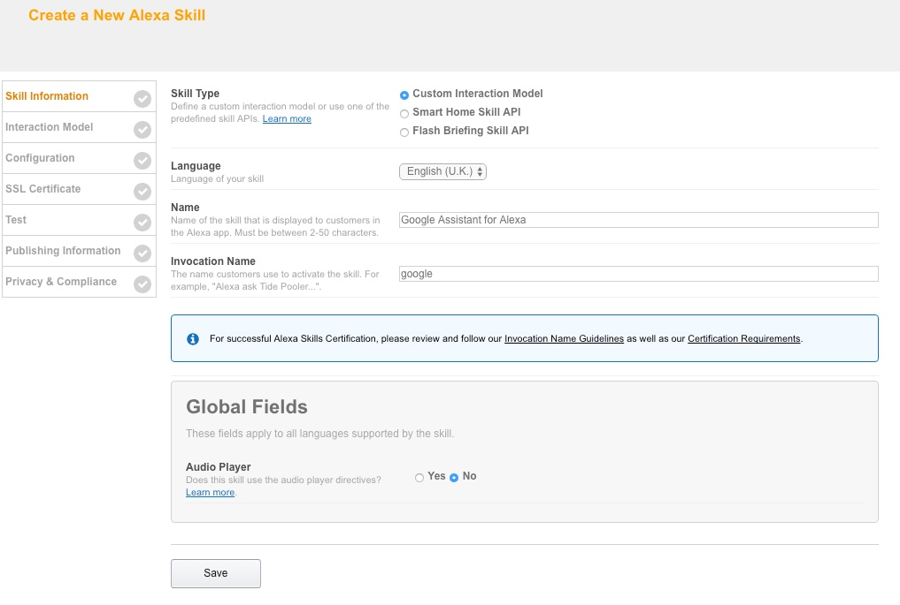

10. You will now be on the "Invocation Model" page.
11. Copy the text below into the "Intent Schema" box.

    ```
    {
      "intents": [
        {
          "intent": "AMAZON.StopIntent"
        },
        {
          "intent": "AMAZON.CancelIntent"
        },
        {
          "slots": [
            {
              "name": "search",
              "type": "SEARCH"
            }
          ],
          "intent": "SearchIntent"
        }
      ]
    }
    ```


12. Under Custom Slot Types:-
13. Type into the "Enter Type" field (NOTE - this is captialised) :-
    ```
    SEARCH
    ```
    
14. Copy the text below and paste into the "Enter Values" box and then click "Add"

    ```
    who is the queen
    why is the sky blue
    ```


15. Copy the text below and paste them into the Sample Utterances box.

    ```
    SearchIntent {search}
    ```
 

16. Click "Save" and then "Next".
17. You will now be on the "Configuration" page.
18. Select "AWS Lambda ARN (Amazon Resource Name)" for the skill Endpoint Type.
19. Then pick the most appropriate geographical region (either US or EU as appropriate) and paste into the box (highlighted in red in the screenshot) the ARN you copied earlier from the AWS Lambda setup.

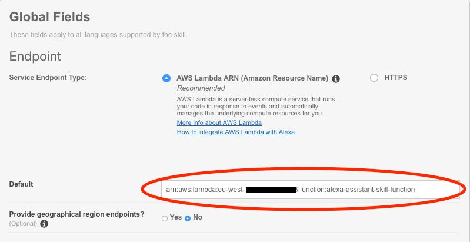 

20. Select "Yes" for Account Linking

At this point we will pause the setup of the skill and setup the google API. Copy the two Redirect URLs lower down the page you are currently on (one will start with https://layla.amazon.com/api/skill/link the other https://pitangui.amazon.com/api/skill/link - see screenshot below) and paste them into a Notepad document on windows or TextEdit on mac. We will need these during the setup of the Google API and later on in the setup of the Lambda function

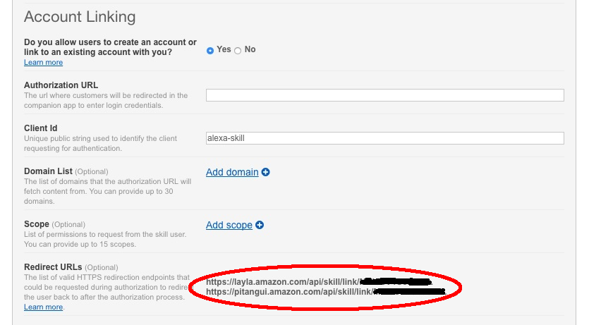

**Leave this page open as we will come back to it after we have setup the Google Assistant API**

### Enable Google Assistant API:-
To enable access to the Google Assistant API, do the following:

1. In a **new** browser tab or window, go to the Cloud Platform Console here https://console.cloud.google.com/project (If this is the first time you have use the google developer console then you will need to agree to the the Terms on service on the pop-up box.)
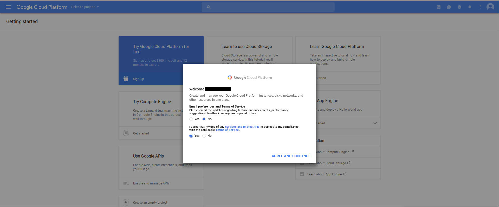

2. Click on "Select a project" and then the "+" button to create a new project


3. Give the project a name, it doesn't really matter what it is but it needs to be unique so Google will add a series of numbers to the end of the name if somebody has already used it. Press create.
4. You will be taken to a new page. It will take about 15 seconds for the project to be created. Look for a notification within the blue bar at the top of the page. Once the project is created click on the the notification and then select the "Create Project: XXX" where XXX is the name that you gave the project.

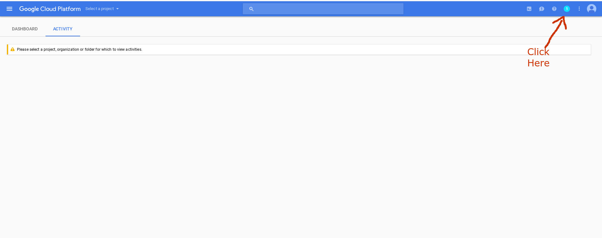

5. Click on this link: - https://console.developers.google.com/apis/api/embeddedassistant.googleapis.com/overview This will take you to a page entitled "API manager".
6. Click on the blue text near the top that says "ENABLE".


7. Once the next page had loaded - click on "Create Credentials"


8. Make sure "Google Assistant API" is selected under "Which API are you using?"
9. Under "Where will you be calling the API from?" select "Web server (e.g. node.js, Tomcat)
9. Under "What data will you be accessing?" select "User data".
9. Click on the blue "What credentials do I need?" button.

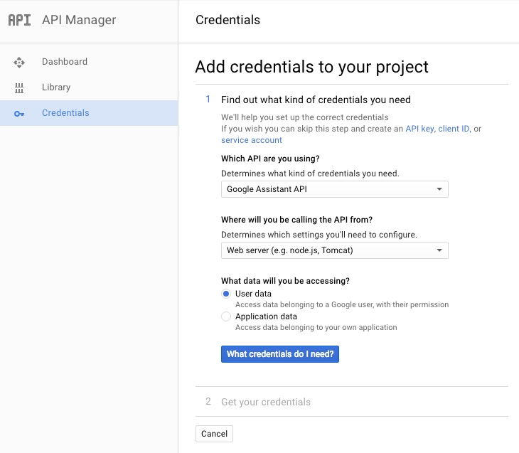

10. On the next page set the Name to :-

    ```
    google_assistant
    ```
    
10. Under Authorised redirect URIs, paste the first of the "Redirect URLS" from the skill setup page and hit "Enter"
11. A second box will appear - into this paste the second "Redirect URL" and then hit "Enter" again
12. Click the blue "Create client ID" button.


13. On the next page the Email address field should auto populate with your Gogole accoutn email address
14. In the "Product name shown to users" enter:-

    ```
    Assistant
    ```

15. Click on the blue "Continue" button.

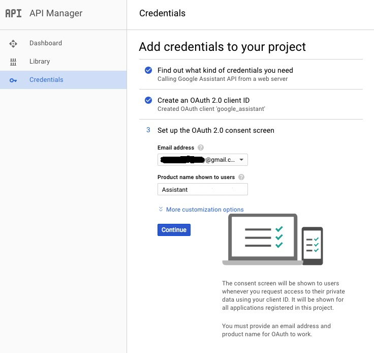

16. On the next page click on the blue text that says "I'll do this later"

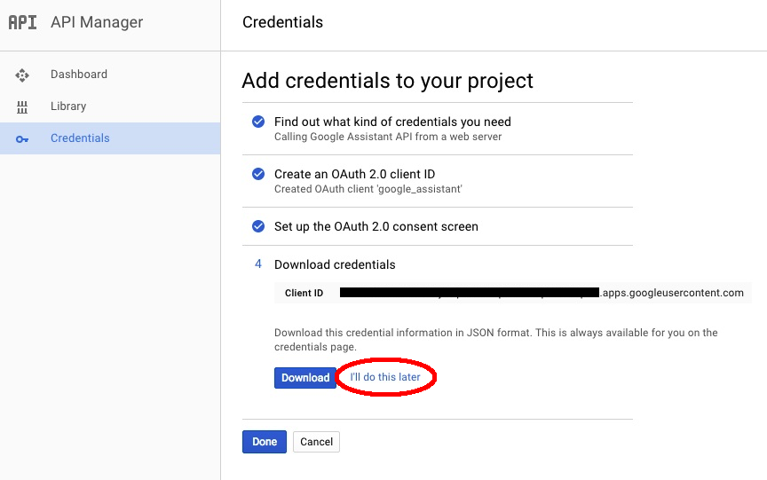

17. A new page will appear. Click on the OAuth 2.0 client ID called "google_assistant"


18. Copy the text in the Client ID box (excluding the Client ID text) and paste it into a new line in your Notepad/TextEdit document 

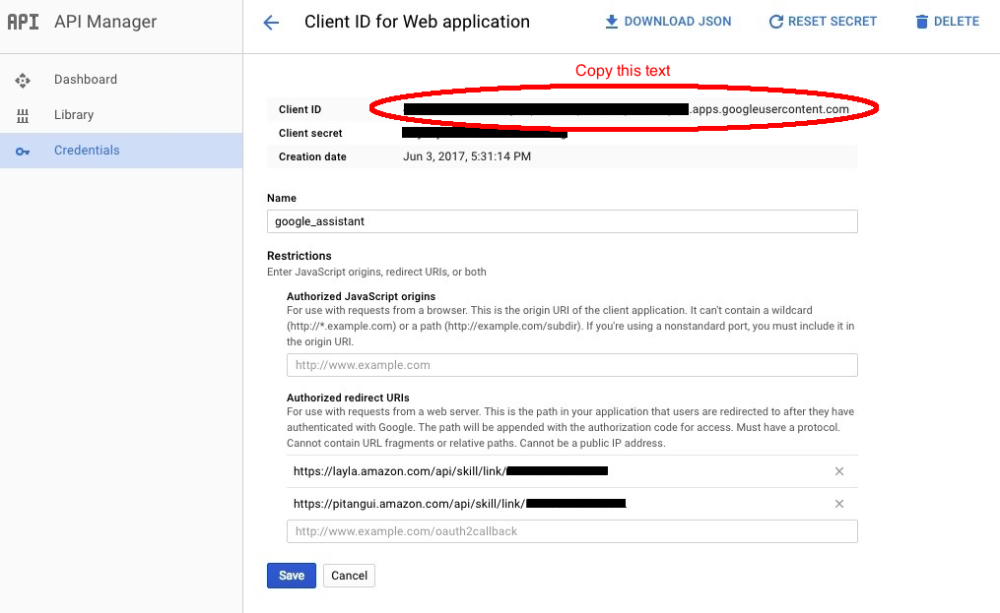

19. Copy the text in the Client Secret box (excluding the Client Secret text) and paste it into a new line in your Notepad/TextEdit document 


You can now close this tab/window


### Alexa Skill Setup (Part 2)

1. Return to the Alexa skill page that we paused at earlier
2. In the Authorization URL paste the following: -

    ```
    https://accounts.google.com/o/oauth2/auth?access_type=offline
    ```
2. Delete the existing text from the "Client ID" field (it will probably say "alexa-skill")  
3. Copy the Client ID from your Notepad/TextEdit document (HINT - it's the longer of the two) and paste it into the Client ID box

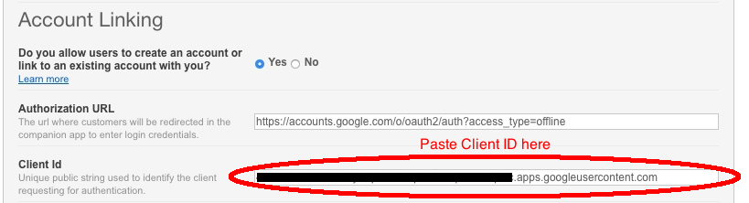

4. Under Domain List : Press "Add domain" and enter:-

    ```
    google.com
    ```

5. Press "Add domain" again for a second box into which enter:-

    ```
    googleapis.com
    ```

6. Under Scope: Press "Add Scope" and enter:-

    ```
    https://www.googleapis.com/auth/assistant-sdk-prototype
    ```
    
7. Press "add scope" again for a second box into which enter:-

    ```
    https://www.googleapis.com/auth/script.external_request
    ```
    


8. Under Authorisation Grant Type make sure "Auth Code Grant" is selected.
9. The Access Token URI should be set to: -
    
    ```
    https://accounts.google.com/o/oauth2/token
    ```

10. Copy the Client Secret from your Notepad/TextEdit document (HINT - it's the shorter of the two) and paste it into the Client Secret box
11. Leave Client Authentication Scheme as "HTTP Basic"
12. Leave eveything under Permission unselected.
13. Paste into the Privacy Policy URL box: -

    ```
    https://www.google.com/policies/privacy/
    ```
    

14. Click "Save" and then "Next".

15. There is no need to go any further through the process i.e. submitting for certification. There is no point in testing the skill on the next page as the simulator cannot authenticate against the Google API. 

**You can now close this window/tab - makes sure you save your Notepad/TextEdit file somewhere safe incase you need these details again**


### AWS Lambda Setup (Part 1)

1. Return to the Lambda Function page we left open earlier.
2. Click on the lambda function "Code" tab.

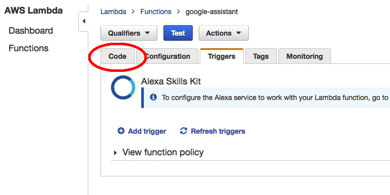 

4. Go the the Environment Variables that you created earlier

3. Paste the google Client Secret from your Notepad/TextEdit doc into the value field for the CLIENT_SECRET variable.
4. Paste the google Client ID from your Notepad/TextEdit doc into the value field for the CLIENT_ID variable.
5. Paste the *first* of the "Redirect URLS" from the skill setup page into the REDIRECT_URL variable. (it will either start with https://layla.amazon.com/api/skill/link/ or https://pitangui.amazon.com/api/skill/link  - it will depend on whether you are US or EU based as to which one will be first)

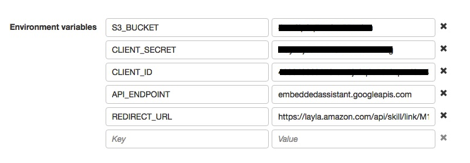

6. Hit "Save" at the top (**Not "Save and Test"** If you do press this then just ignore the error that appears)


### Linking the skill to your Google Account

1. In order to use the Google Assistant, you must share certain activity data with Google. The Google Assistant needs this data to function properly; this is not specific to the SDK.

2. Open the Activity Controls page https://myaccount.google.com/activitycontrols for the Google account that you want to use with the Assistant. Ensure the following toggle switches are enabled (blue):

    1. Web & App Activity
    2. Location History
    3. Device Information
    4. Voice & Audio Activity
    
3. Launch the Google skill by asking "Alexa, open google" (or whatever invocation name you gave e.g "my assistant"
4. The skill will tell you if you have forgotten to set any environment variables or if there any other set-up issues
4. You will then be prompted to link your account through the Alexa app.
5. Select the Google account you want to use (it does not have to be the one you authorised the API with) and then make sure you click "Allow" on the Google authorisation page. 


6. NOTE - you can deauthorise the app at any time by removing it from your google account by going here https://myaccount.google.com/permissions?pli=1 and removing the app called "Assistant"

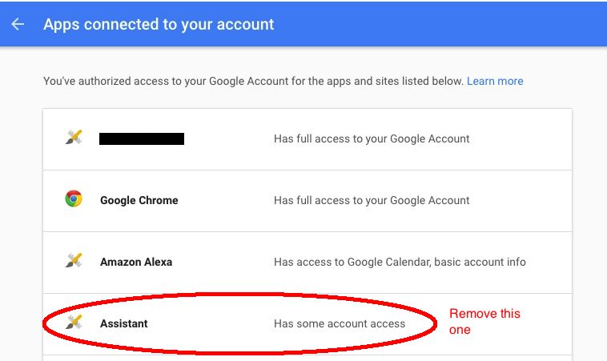

7. If you want local searches to work then you will need to set a home and work address as per these instructions :- https://support.google.com/maps/answer/3093979?co=GENIE.Platform%3DDesktop&hl=en


## S3 BUCKET BUCKET INFORMATION

The skill will automatically create an S3 bucket using the name set in the S3_BUCKET environmental variable. This will contain two publicly accessible mp3 files, with file names based upon the bucket name. (s3_bucket_name).mp3 contains the response from the Google Assistant API which alexa plays as part of an SSML response. The second file (s3_bucket_name)0.mp3 is a chime sound which is added to the response when a follow-on query is expected by the API.
As these files must be public inorder for Alexa to play them, it is recommended as per the setup instructions that the bucket is given a completely random name to provide limited security through obfuscation.
Once the Alexa skill session ends - the response mp3 is automatically deleted from the S3 bucket although this can take a couple of hours

The S3 bucket can be accessed from your AWS account at any time from AWS https://console.aws.amazon.com/s3/

